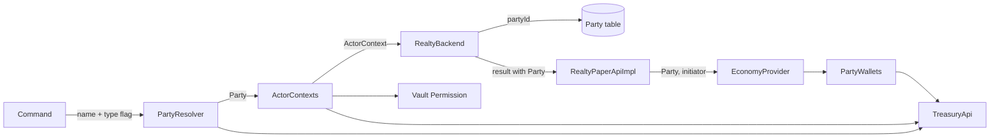

# Treasury Parties, Stage 1: Implementation Plan

> **For agentic workers:** REQUIRED SUB-SKILL: Use superpowers:subagent-driven-development (recommended) or superpowers:executing-plans to implement this plan task-by-task. Steps use checkbox (`- [ ]`) syntax for tracking.

**Goal:** Let a leasehold landlord or a freehold authority be a player, a Treasury account, or a permission group backed by a Treasury account, with money moving only through the account the party names.

**Architecture:** A sealed `Party` value in `realty-backend-api` replaces the landlord and authority UUIDs. Migration V19 stores parties in a `Party` table that contracts and history reference by id. The backend stores and compares parties and never calls Treasury. The paper plugin resolves names to parties, builds an `ActorContext` that says which parties a player acts for, and pays through `PartyWallets`. `realty-rest` shows every party as a `PartyRef`.

**Tech Stack:** Java 25, Gradle, MyBatis 3.5.19 with annotation mappers, MariaDB 11.7, Testcontainers, Incendo Cloud 2.0.0, Configurate 4.2.0, Treasury API 2.0.0, Vault API 1.7, WorldGuard 7.0.18, Javalin, JUnit 5, Mockito 5. TypeScript, React and Vitest for the explorer.

**Spec:** `docs/superpowers/specs/2026-09-29-treasury-parties-design.md`. Read it with this plan. Where the two differ, the section *Decisions beyond the spec* below says which one wins and why.

## Global Constraints

- Only two roles accept a non-player party in stage 1: leasehold landlord and freehold authority. Titleholder and tenant stay players in data and commands.
- The backend (`realty-backend`, `realty-backend-api`) never calls Treasury or Vault.
- A `PERSONAL` party is always referenced by player UUID, never by account id. A PERSONAL Treasury account can never be named as an account party.
- Display names of accounts are never stored. They are looked up when shown.
- Every payment flow stays all-or-nothing: a payment that fails leaves nothing behind. The 2-decimal normalisation stays.
- The migration is `V19`. `realty-rest` expects schema version `19`. Plugin and `realty-rest` deploy together.
- The project version becomes `2.0.0-SNAPSHOT`. All modules share one version.
- Party kinds, exactly: `PERSONAL`, `BUSINESS`, `GOVERNMENT`, `SYSTEM`, `GROUP`. In REST they are lower case.
- Display forms, exactly: `Steve`, `GovSecurity (government)`, `Acme (business)`, `Mint (system)`, `police (group)`.
- Type flags, exactly: `--government`, `--business`, `--system`, `--group`. They are mutually exclusive.
- New permissions, exactly: `realty.command.group`, `realty.bypass.conflict-of-interest`.
- New setting, exactly: `account-managers: members`, with values `members` or `authorizers`.
- On a server without Treasury, only players can be parties. Every type flag is refused with "requires Treasury".
- Inject the interfaces that already exist (`TreasuryApi`, Vault's `Permission`, Bukkit's `Server`). Do not add a wrapper type that only forwards calls.
- Backend tests need Docker. Start Docker before you run `:realty-backend:test`.
- Deliver the work as a stack of draft pull requests with `gh stack`. Each PR description is one plain paragraph: no headings, lists, emoji or footer. Never run `gh stack merge`.

## Verified before writing

Checked on 2026-09-29. Each line names where the fact comes from.

| Fact | Source |
|---|---|
| Treasury **rejects** a transfer when the source **or the destination** account has `requiresAuthorization` and the request has no authorizer. It throws `SecurityException("Authorizer required")` before any money moves. | `treasury/src/main/java/net/democracycraft/treasury/services/impl/LedgerServiceImpl.java:145-178` |
| Treasury's ledger column `initiator_uuid_bin` is `NOT NULL`. A transfer with a null initiator fails. | `treasury/src/main/resources/schema.sql:117` |
| Treasury does **not** refuse a transfer into or out of an archived account. `getGovernmentAccountByName` also returns archived accounts. | `LedgerServiceImpl.transferInternal`, `AccountMapper.java:62-71` |
| `TreasuryApi` sees only direct member and authorizer rows. Members and authorizers granted through a LuckPerms group are not visible to Realty. | `AccountServiceImpl.java:132-149` |
| One shared MyBatis result map can build every `Party` kind and be reused from another mapper with `@Arg(resultMap = …, columnPrefix = …)`. Run on MyBatis 3.5.19 against SQLite; output matched for all three kinds. | Scratch test, 2026-09-29 |
| Migrations are a hard-coded list. `MariaSchemaMigratorTest` fails if a file is unregistered. | `MariaSchemaMigrator.java:41-60` |
| Party columns are native MariaDB `UUID`. No foreign key references them today. | `V1__maria_initial_schema.sql:19-32` |
| History rows store the landlord in `tenantId` when there is no tenant, because the column is `NOT NULL`. | `RealtyBackendImpl.java:358, 416, 448, 618, 1246` |
| Every `EconomyProvider` call runs on the server main thread. | `RealtyPaperApiImpl.java`, `Realty.java:264-267` |
| The existing REST route is `GET /v1/players/regions?player=…`. No REST route has a path parameter yet. | `RealtyRestServer.java:62-85` |
| Only `realty-paper` depends on `treasury-api`. The query-service module cannot reach Treasury today. | `realty-paper/build.gradle.kts:23` |
| Nothing in Realty obtains Vault's `Permission` service. | `Realty.java:408-424` |
| Docker was not running, so no database test was run while writing this plan. | `docker info` |

## Decisions beyond the spec

The spec was revised on 2026-09-30 to include these decisions; the spec is now the reference for them, and this table is kept as the record of when each was taken.

The spec is silent or ambiguous on these points. The plan picks one answer for each so that work is not blocked. The owner decided D2, D7, D8 and D10 on 2026-09-29; do not reopen them. The owner may overrule any other before execution starts.

| # | Question | Choice in this plan |
|---|---|---|
| D1 | Accounts that require authorization | Treasury rejects them, so the spec's rule applies: such an account cannot be assigned as a party. Because the flag can be turned on later, `PartyWallets` also fails a payment with a clear message when it meets one. |
| D2 | Initiator for scheduled payments | The spec says `null`. Treasury cannot store `null`. `TreasuryEconomyProvider` sends the fixed value `UUID.nameUUIDFromBytes("realty:system".getBytes(UTF_8))` when the initiator is `null`. No account is created for it. **Decided by the owner.** |
| D3 | History rows with no tenant | V19 makes `LeaseholdHistory.tenantId` nullable. New rows with no tenant store `NULL`. Old rows are not changed. |
| D4 | Indexes dropped by V19 | The spec names `idx_leasehold_contract_landlord`. V19 also drops `idx_freehold_contract_authority`, which sits on a removed column. |
| D5 | Landlord checks the spec does not list | `cancelTermination` (line 1238) and `withdrawModification` (line 1159) also become `manages` checks. Any manager of the landlord party may withdraw a landlord proposal. |
| D6 | `proposerId` for a landlord proposal | The column is `UUID NOT NULL`. It stores the landlord's UUID when the landlord is a player (as today), otherwise the acting player's UUID. |
| D7 | Who may run `/realty set authority` | The permission `realty.command.set.authority` alone decides. It defaults to `op`, so only admins hold it. Whoever holds it may set the authority of any plot to any party. The spec's assignment rule does **not** apply to this command. The WorldGuard owner check (`SetCommandGroup.java:399`) and the permission `realty.command.set.authority.others` are removed. The owner checks at lines 88 and 287 stay. **Decided by the owner.** |
| D8 | `/realty list` syntax | Today there is no `/realty list <name>`; another player is reached with `--player <name>`, and `/realty me` is a root command. The command becomes `/realty list [name] [type flag]`. The `--player` flag is removed. `/realty me` stays. **Decided by the owner.** |
| D9 | Conflict of interest for an offline invitee | Vault cannot tell the groups of an offline player. `inviteAgent` checks what it can, and `acceptAgentInvite` checks again when the invitee accepts. |
| D10 | `/realty group unmap` | History rows reference the party row, so the row cannot be deleted while history uses it. `unmap` is refused while any contract **or history row** uses the group. **Decided by the owner.** |
| D11 | Default titleholder setting | `default-freehold-titleholder-uuid` becomes `default-freehold-titleholder: { name: … }` or `{ uuid: … }`. It must be a player. A `type` is refused in stage 1. |
| D12 | Tenant and titleholder as `Party` | The entity components stay `UUID tenantId` and `UUID titleHolderId`. The entities gain `tenant()` and `titleHolder()` methods that return a `Party.Personal`. Stages 2 and 3 change the components. |
| D13 | Building `ActorContext` | Treasury has no query for "accounts this player authorizes". The plugin tests a given list of candidate parties instead: the parties on the region in question, plus any party being assigned. The inbox uses every non-player party in the `Party` table. |
| D14 | Explorer | The spec does not mention `realty-explorer`. Its player links would break for account ids. The plan shows a non-player party as plain text with its kind and adds no new screen. |
| D15 | Scheduled termination refund | Its result is ignored today. The plan logs a warning when it fails. |

## Review Focus

These five conditions follow from the spec, but the spec's test list does not cover them. Each has a test in the task named.

1. **An account starts to require authorization after it became a party.** The payment fails with "Account #42 requires authorization" and the flow rolls back. Test in Task 7.
2. **An invitee who manages the authority through a group is offline when invited.** The invite is stored, and accepting it is refused. Test in Task 10.
3. **A group is written with different capitals.** `Police --group` finds the party mapped as `police`. Tests in Tasks 1 and 13.
4. **A group's mapping changes while contracts use it.** The contract keeps its party id, the next payment goes to the new account, and members still manage the contract. Test in Task 16.
5. **A notification is addressed to a group with no member online.** Nothing is sent and nothing throws. Test in Task 18.

## How the parts connect



## Paths used in this plan

| Short form | Full path |
|---|---|
| `{backend-api}` | `realty-backend-api/src/main/java/io/github/md5sha256/realty` |
| `{backend}` | `realty-backend/src/main/java/io/github/md5sha256/realty` |
| `{backend-test}` | `realty-backend/src/test/java/io/github/md5sha256/realty` |
| `{paper-api}` | `realty-paper-api/src/main/java/io/github/md5sha256/realty/api` |
| `{paper}` | `realty-paper/src/main/java/io/github/md5sha256/realty` |
| `{paper-test}` | `realty-paper/src/test/java/io/github/md5sha256/realty` |
| `{query}` | `realty-paper-adapters/query-service/src/main/java/io/github/md5sha256/realty/adapter/query` |
| `{query-test}` | `realty-paper-adapters/query-service/src/test/java/io/github/md5sha256/realty/adapter/query` |
| `{rest}` | `realty-web/realty-rest/src/main/java/io/github/md5sha256/realty/rest` |
| `{rest-test}` | `realty-web/realty-rest/src/test/java/io/github/md5sha256/realty/rest` |
| `{explorer}` | `realty-web/realty-explorer/src` |

## Delivery

The stack sits on the branch `feat/treasury-parties-spec`, which holds the spec and this plan.

| PR | Branch | Tasks | What it delivers |
|---|---|---|---|
| 1 | `feat/party-model` | 1 to 6 | `Party`, V19, entities, mappers, public API, version 2.0.0 |
| 2 | `feat/party-payments` | 7 to 8 | `EconomyProvider` on parties, `PartyWallets` |
| 3 | `feat/party-authorization` | 9 to 12 | `ActorContext`, assignment rules, conflict of interest |
| 4 | `feat/party-commands` | 13 to 17 | Settings, `PartyResolver`, commands, group mapping, display |
| 5 | `feat/party-notifications` | 18 to 19 | Recipients, inbox, listings, counts |
| 6 | `feat/party-rest` | 20 to 23 | Account names, `PartyRef`, parties endpoint, explorer, release notes |

Start PR 1 with `gh stack init feat/party-model`. Start each later PR with `gh stack add -m "<first commit message>" <branch>`. After the last task, run `gh stack submit --auto` and set each title and body with `gh pr edit`. Leave every PR as a draft.

Each task ends with one commit, except Task 7, which is committed together with Task 8. Every commit message ends with the line `Co-Authored-By: Claude Fable 5.1 <noreply@anthropic.com>`.

Each PR must leave the whole build green: `./gradlew build` passes at the end of Tasks 6, 8, 12, 17, 19 and 23.

`realty-areashop-importer` is excluded from the build (`settings.gradle.kts`). Tasks that touch it edit the source to match and cannot compile it. Say so in the PR description.

---

# PR 1: Party model

After PR 1 every party is still a player. The only change a server operator can see is the schema.

### Task 1: `Party` and `AccountKind`

**Files:**
- Create: `{backend-api}/api/Party.java`, `{backend-api}/api/AccountKind.java`, `{backend-api}/api/PartyKind.java`
- Test: `{backend-test}/api/PartyTest.java`

**Interfaces:**
- Produces:

```java
public enum AccountKind { BUSINESS, GOVERNMENT, SYSTEM }
public enum PartyKind { PERSONAL, BUSINESS, GOVERNMENT, SYSTEM, GROUP }

public sealed interface Party {
    record Personal(@NotNull UUID playerUuid) implements Party {}
    record Account(int accountId, @NotNull AccountKind kind) implements Party {}
    record Group(@NotNull String groupName, int accountId, @NotNull AccountKind accountKind) implements Party {}

    @NotNull PartyKind partyKind();                        // Account maps its AccountKind by name
    static @Nullable UUID playerUuidOf(@Nullable Party party);   // the UUID of a Personal, else null
    /** The account that holds this party's money, or null for a Personal. */
    @Nullable Integer moneyAccountId();
}
```

`Group`'s compact constructor lower-cases `groupName` with `Locale.ROOT`.

- [ ] **Step 1: Write the failing tests** in `PartyTest`:

```java
@Test void group_nameIsLowerCased() {
    assertEquals(new Party.Group("police", 42, AccountKind.GOVERNMENT),
                 new Party.Group("Police", 42, AccountKind.GOVERNMENT));
}
@Test void partyKind_matchesEachKind() {
    assertEquals(PartyKind.PERSONAL, new Party.Personal(UUID.randomUUID()).partyKind());
    assertEquals(PartyKind.SYSTEM, new Party.Account(7, AccountKind.SYSTEM).partyKind());
    assertEquals(PartyKind.GROUP, new Party.Group("police", 42, AccountKind.GOVERNMENT).partyKind());
}
@Test void playerUuidOf_isNullForNonPlayers() {
    UUID id = UUID.randomUUID();
    assertEquals(id, Party.playerUuidOf(new Party.Personal(id)));
    assertNull(Party.playerUuidOf(new Party.Account(7, AccountKind.BUSINESS)));
    assertNull(Party.playerUuidOf(null));
}
@Test void moneyAccountId_namesTheGroupsAccount() {
    assertEquals(42, new Party.Group("police", 42, AccountKind.GOVERNMENT).moneyAccountId());
    assertNull(new Party.Personal(UUID.randomUUID()).moneyAccountId());
}
```

- [ ] **Step 2: Run** `./gradlew :realty-backend:test --tests '*PartyTest'`. Expected: compilation fails, `Party` not found.
- [ ] **Step 3: Implement** the three types as specified above.
- [ ] **Step 4: Run** the same command. Expected: 4 tests pass.
- [ ] **Step 5: Commit** `feat(party): add the Party value and its kinds`.

### Task 2: Migration V19

**Files:**
- Create: `realty-backend/src/main/resources/sql/migrations/V19__parties.sql`
- Modify: `{backend}/database/maria/MariaSchemaMigrator.java:59` (append the step)
- Modify: `{rest}/SchemaVersionCheck.java:36` (`EXPECTED_VERSION = 19`)
- Modify: `{backend-test}/database/AbstractDatabaseTest.java:58-90` (add `Party` to the truncate list)
- Test: `{backend-test}/database/PartiesMigrationTest.java`

**Interfaces:**
- Produces: table `Party` as in the spec, and these columns, constraints and indexes.

| Table | Removed column | New column | Foreign key | Index |
|---|---|---|---|---|
| `LeaseholdContract` | `landlordId` | `landlordPartyId INT NOT NULL` | `fk_leasehold_contract_landlord` | `idx_leasehold_contract_landlord_party` |
| `LeaseholdHistory` | `landlordId` | `landlordPartyId INT NOT NULL` | `fk_leasehold_history_landlord` | `idx_leasehold_history_landlord_party` |
| `FreeholdContract` | `authorityId` | `authorityPartyId INT NOT NULL` | `fk_freehold_contract_authority` | `idx_freehold_contract_authority_party` |
| `FreeholdHistory` | `authorityId` | `authorityPartyId INT NOT NULL` | `fk_freehold_history_authority` | `idx_freehold_history_authority_party` |

- [ ] **Step 1: Write the failing test.** Copy the pattern of `PurgeWorldEditSchematicsMigrationTest.java:31-74`: create a fresh database, migrate with the steps filtered to `version <= 18`, seed with raw JDBC, then migrate with the full list. Seed one player `A` as landlord of a lease **and** authority of a freehold, a second player `B` as landlord in history only, and a lease history row.

```java
@Test void everyOldUuidBecomesOnePersonalParty()      // COUNT(*) FROM Party = 2, both kind 'PERSONAL'
@Test void repointedRowsMatchTheirOriginals()         // Party.playerUuid joined through landlordPartyId = A for the lease,
                                                      // through authorityPartyId = A for the freehold, = B for the history row
@Test void oldColumnsAndIndexesAreGone()              // information_schema has no landlordId / authorityId column on the four
                                                      // tables, and no idx_leasehold_contract_landlord or idx_freehold_contract_authority
@Test void historyTenantMayBeNull()                   // UPDATE LeaseholdHistory SET tenantId = NULL succeeds
@Test void shapeCheckRejectsMalformedRows()           // each of these INSERTs throws SQLException:
    // ('PERSONAL', playerUuid NULL)
    // ('GOVERNMENT', accountId 42, playerUuid set)
    // ('GROUP', groupName 'police', groupAccountId NULL)
    // ('GROUP', groupName 'police', groupAccountId 42, groupAccountKind NULL)
@Test void twoGroupsMayShareOneAccount()              // two GROUP rows with groupAccountId 42 both insert
```

- [ ] **Step 2: Run** `./gradlew :realty-backend:test --tests '*PartiesMigrationTest' --tests '*MariaSchemaMigratorTest'`. Expected: fails, no step 19.
- [ ] **Step 3: Write `V19__parties.sql`.** Start with a `--` comment that says why, as V18 does. Use the `CREATE TABLE Party` statement from the spec unchanged. Then:

```sql
INSERT INTO Party (kind, playerUuid)
SELECT 'PERSONAL', u FROM (
    SELECT landlordId AS u FROM LeaseholdContract
    UNION SELECT landlordId FROM LeaseholdHistory
    UNION SELECT authorityId FROM FreeholdContract
    UNION SELECT authorityId FROM FreeholdHistory
) AS oldParties;

ALTER TABLE LeaseholdContract ADD COLUMN landlordPartyId INT NULL;
UPDATE LeaseholdContract lc JOIN Party p ON p.playerUuid = lc.landlordId
    SET lc.landlordPartyId = p.partyId;
DROP INDEX idx_leasehold_contract_landlord ON LeaseholdContract;
ALTER TABLE LeaseholdContract DROP COLUMN landlordId, MODIFY landlordPartyId INT NOT NULL;
CREATE INDEX idx_leasehold_contract_landlord_party ON LeaseholdContract (landlordPartyId);
ALTER TABLE LeaseholdContract ADD CONSTRAINT fk_leasehold_contract_landlord
    FOREIGN KEY (landlordPartyId) REFERENCES Party (partyId);
```

Repeat the last six statements for the other three tables with the names in the table above. Only `FreeholdContract` has an old index to drop (`idx_freehold_contract_authority`); the two history tables have none. End with:

```sql
ALTER TABLE LeaseholdHistory MODIFY tenantId UUID NULL;
```

MariaDB commits each statement that changes the schema (a data definition, or DDL, statement) by itself, so a failure part-way leaves a half-migrated schema. Keep the statements in this order, so that no step drops data before it has been copied.

- [ ] **Step 4: Register** `new MigrationStep(19, "parties", "V19__parties.sql")`, set `EXPECTED_VERSION = 19`, and add `Party` to the truncate list.
- [ ] **Step 5: Run** the command from Step 2. Expected: all pass.
- [ ] **Step 6: Commit** `feat(party): store parties in their own table (V19)`.

### Task 3: `PartyMapper` and the shared result map

**Files:**
- Create: `{backend}/database/mapper/PartyMapper.java`, `{backend}/database/maria/mapper/MariaPartyMapper.java`, `{backend}/database/maria/mapper/PartySql.java`
- Modify: `{backend}/database/maria/MariaDatabase.java:94-121` (`addMapper`), `{backend}/database/SqlSessionWrapper.java`, `{backend}/database/maria/MariaSqlSession.java` (accessor `partyMapper()`)
- Test: `{backend-test}/database/PartyMapperTest.java`

**Interfaces:**
- Consumes: `Party`, `AccountKind` (Task 1); table `Party` (Task 2).
- Produces:

```java
public interface PartyMapper {
    /** The id of the party's row, inserting the row if needed. A Group is never inserted here. */
    int findOrInsert(@NotNull Party party);      // throws IllegalStateException("group not mapped: <name>") for an unmapped Group
    @Nullable Integer findId(@NotNull Party party);   // a Group is found by groupName alone
    @Nullable Party selectById(int partyId);
}

final class PartySql {
    /** Result map id, for @Arg(resultMap = PartySql.RESULT_MAP, columnPrefix = "landlord_"). */
    static final String RESULT_MAP = "io.github.md5sha256.realty.database.maria.mapper.MariaPartyMapper.party";
    /** Select lists for the two aliases used by joins: table alias `lp` → prefix `landlord_`, `ap` → `authority_`. */
    static final String LANDLORD_COLUMNS;   // " lp.kind AS landlord_kind, lp.playerUuid AS landlord_playerUuid, … "
    static final String AUTHORITY_COLUMNS;
}
```

`findOrInsert` runs `INSERT IGNORE` and then selects the id, so that two callers at once get the same row.

The result map is declared once, on `MariaPartyMapper.selectById`. This form has been run and works:

```java
@Results(id = "party")
@TypeDiscriminator(column = "kind", javaType = String.class, cases = {
    @Case(value = "PERSONAL", type = Party.Personal.class, constructArgs = {
        @Arg(column = "playerUuid", javaType = UUID.class)}),
    @Case(value = "BUSINESS", type = Party.Account.class, constructArgs = {
        @Arg(column = "accountId", javaType = int.class),
        @Arg(column = "kind", javaType = AccountKind.class)}),
    // GOVERNMENT and SYSTEM: same as BUSINESS
    @Case(value = "GROUP", type = Party.Group.class, constructArgs = {
        @Arg(column = "groupName", javaType = String.class),
        @Arg(column = "groupAccountId", javaType = int.class),
        @Arg(column = "groupAccountKind", javaType = AccountKind.class)})
})
```

The string constants in `PartySql` must be compile-time constants, because annotation values take nothing else.

- [ ] **Step 1: Write the failing tests** in `PartyMapperTest` (extends `AbstractDatabaseTest`):

```java
@Test void findOrInsert_isIdempotent()          // same Personal twice → same id, COUNT(*) = 1
@Test void findOrInsert_account()               // Account(42, GOVERNMENT) → selectById returns an equal value
@Test void findOrInsert_unmappedGroupThrows()   // Group("police", 42, GOVERNMENT) → IllegalStateException
@Test void findId_groupIgnoresTheAccount()      // row GROUP police→42 inserted by JDBC; findId(Group("police", 99, BUSINESS)) returns its id
@Test void selectById_buildsEachKind()          // one row per kind; each comes back as the matching record
@Test void selectById_unknownIsNull()
```

- [ ] **Step 2: Run** `./gradlew :realty-backend:test --tests '*PartyMapperTest'`. Expected: compilation fails.
- [ ] **Step 3: Implement** the mapper, the constants and the four registrations.
- [ ] **Step 4: Run** the same command. Expected: 6 tests pass.
- [ ] **Step 5: Commit** `feat(party): add the party mapper and one shared result mapping`.

### Task 4: Leasehold landlord becomes a `Party`

This task changes how the landlord is represented and nothing else. Every identity check keeps its meaning: write `new Party.Personal(actorId).equals(lease.landlord())` where the code had `actorId.equals(lease.landlordId())`. Task 9 replaces those checks.

**Files:**
- Modify entities: `{backend-api}/database/entity/LeaseholdContractEntity.java`, `TerminatedLeaseholdView.java`, `HistoryEntry.java` (the `Leasehold` record), `{backend}/database/entity/LeaseholdHistoryEntity.java`, `ExpiredLeaseholdView.java`
- Modify mappers: `{backend}/database/mapper/LeaseholdContractMapper.java`, `LeaseholdHistoryMapper.java`, `LeaseholdModificationMapper.java:50`, `RealtyRegionMapper.java` (landlord methods) and their `Maria…` implementations; `LeaseholdHistorySqlProvider.java:11,22,43`; the leasehold branch of `MariaActivityMapper.java:56`
- Modify: `{backend-api}/api/RealtyBackend.java`, `{backend}/database/RealtyBackendImpl.java` (landlord lines 358-361, 416-419, 448-451, 465-480, 588, 615-625, 754-800, 818, 887-892, 972-981, 1058-1088, 1119-1139, 1166-1177, 1215-1251, 1357, 1461, 2068-2103, 2183-2213, 2272)
- Modify callers so that every module compiles: `{paper}/api/RealtyPaperApiImpl.java`, `{paper}/Realty.java:293,521,541,559`, the commands `UnrentCommand`, `ModifyCommandGroup`, `TerminateCommand`, `SetCommandGroup`, `HistoryCommand`, `SignCommand`, `InfoCommand`, `RentCommand`, `CreateCommand`, `RegisterCommand`; `{rest}/RealtyRestMain.java:62`, `RegionHandler.java`, `RegionHistoryHandler.java`, `PlayerSummaryHandler.java`; `realty-paper-plan-extension/…/RealtyDataExtension.java:166,188,210,214,250`
- Test: `{backend-test}/database/MapperTest.java`, `RealtyBackendImplTest.java`, `FailedTenancyPaymentTest.java`, `RentedRegionViewTest.java:31`; `{paper-test}/api/RealtyPaperApiImplTest.java`; `{rest-test}/TestServers.java`, `RegionContractFieldsTest.java`, `RegionHistoryEndpointTest.java`

**Interfaces:**
- Consumes: `PartyMapper.findOrInsert`, `PartySql.RESULT_MAP`, `PartySql.LANDLORD_COLUMNS` (Task 3).
- Produces:

```java
// Entities: the component `UUID landlordId` becomes `Party landlord` in each record named above.
// HistoryEntry.Leasehold and LeaseholdHistoryEntity: `tenantId` becomes @Nullable.
// LeaseholdContractEntity gains:
public @Nullable Party tenant();     // new Party.Personal(tenantId), or null

// ActivityRow: `UUID secondPlayerId` becomes `Party secondParty`. The agent branch of the
// UNION selects 'PERSONAL' AS second_kind, actorId AS second_playerUuid and NULL for the rest.

// RealtyBackend:
boolean createLeasehold(String regionId, UUID worldId, double price, long durationSeconds,
                        int maxRenewals, @NotNull Party landlord);
SetLandlordResult setLandlord(String regionId, UUID worldId, @NotNull Party landlord);
void updateSubregionLandlords(List<String> childRegionIds, UUID worldId, @NotNull Party newLandlord);
List<LeaseholdModificationView> listModificationsAwaitingLandlord(@NotNull Party landlord);
List<String> listRegionNamesByLandlord(@NotNull Party landlord);
int countRegionsByLandlord(@NotNull Party landlord);
int countOccupiedLeaseholdsByLandlord(@NotNull Party landlord);
// Every result record with a `UUID landlordId` component carries `Party landlord` instead.
// SetLandlordResult.Success carries `Party previousLandlord`.

// RealtyBackendImpl constructor: the name resolver becomes
Function<Party, CompletableFuture<String>> partyNameResolver
```

Rules the implementer cannot infer:
- Every read of a lease joins `Party lp ON lp.partyId = lc.landlordPartyId` and maps the landlord with `@Arg(resultMap = PartySql.RESULT_MAP, columnPrefix = "landlord_", javaType = Party.class)`.
- Every write turns the party into an id with `findOrInsert` in the same session as the write.
- A lookup by landlord (`countByLandlord` and the like) uses `findId`. When it returns `null`, the answer is zero or an empty list, and no row is inserted.
- A history row with no tenant stores `NULL` in `tenantId` (D3). Stop writing the landlord there.
- `proposeModification` by the landlord stores `proposerId` by rule D6.
- The history search keeps its `playerId` filter. Its landlord side becomes `lp.kind = 'PERSONAL' AND lp.playerUuid = #{playerId}`.
- In `Realty.java` and `RealtyRestMain.java`, pass an interim resolver: a `Personal` resolves through the existing username function, and any other party resolves to `party.toString()`. Task 17 and Task 21 replace it.
- Callers outside the backend that need a UUID use `Party.playerUuidOf(…)` for now.

- [ ] **Step 1: Write the failing tests.** Add to `MapperTest`:

```java
@Test void lease_landlordRoundTripsForEachKind()
// insert GROUP row police→42 by JDBC; for each of Personal(A), Account(42, GOVERNMENT), Group("police", 42, GOVERNMENT):
// createLeasehold(...) then leaseholdContractMapper().selectByRegion(...).landlord() equals the party
@Test void lease_twoLeasesShareOnePartyRow()          // two leases, same Account landlord → COUNT(*) FROM Party = 1
@Test void history_withoutTenantStoresNull()          // setPrice on a vacant lease → newest LeaseholdHistory row has tenantId NULL
@Test void countByLandlord_unknownPartyIsZeroAndInsertsNothing()
```

Add to `RealtyBackendImplTest`:

```java
@Test void historySearchByPlayer_stillFindsAPlayerLandlord()
@Test void historySearchByPlayer_ignoresAccountLandlords()
```

- [ ] **Step 2: Run** `./gradlew :realty-backend:test --tests '*MapperTest' --tests '*RealtyBackendImplTest'`. Expected: compilation fails.
- [ ] **Step 3: Implement.** Change the entities first and let the compiler list every site. In existing tests, wrap landlord UUIDs as `new Party.Personal(…)`.
- [ ] **Step 4: Run** `./gradlew build`. Expected: every module compiles and every test passes.
- [ ] **Step 5: Commit** `refactor(lease): the landlord of a lease is a party`.

### Task 5: Freehold authority becomes a `Party`

The same change as Task 4, for the authority.

**Files:**
- Modify entities: `{backend-api}/database/entity/FreeholdContractEntity.java`, `HistoryEntry.java` (the `Freehold` record), `{backend}/database/entity/FreeholdHistoryEntity.java`
- Modify mappers: `{backend}/database/mapper/FreeholdContractMapper.java:34,49,150-155`, `FreeholdHistoryMapper.java`, `RealtyRegionMapper.java` (authority methods) and their `Maria…` implementations; `FreeholdHistorySqlProvider.java:11,22,43`; the freehold branch of `MariaActivityMapper.java:45`
- Modify: `RealtyBackend.java`, `RealtyBackendImpl.java` (authority lines 114, 222, 281, 345, 393, 492-500, 530-569, 648-684, 739, 1349, 1473-1484, 1575, 1609, 1655, 1690, 1725, 1784-1909, 2162-2164, 2268), and the same callers as Task 4 where they read the authority
- Test: `MapperTest.java`, `RealtyBackendImplTest.java`, `AgentLogicTest.java`, `FailedPurchaseTest.java`, `ActiveAuctionQueryTest.java`, `ConcurrencyTest.java`

**Interfaces:**
- Consumes: `PartySql.AUTHORITY_COLUMNS` with the join alias `ap` (Task 3).
- Produces:

```java
// FreeholdContractEntity: `UUID authorityId` becomes `Party authority`; gains
public @Nullable Party titleHolder();   // new Party.Personal(titleHolderId), or null

// RealtyBackend:
boolean createFreehold(String regionId, UUID worldId, @Nullable Double price,
                       @NotNull Party authority, @Nullable UUID titleHolder);
SetAuthorityResult setAuthority(String regionId, UUID worldId, @NotNull Party authority);
int countRegionsByAuthority(@NotNull Party authority);
// Every result record with a `UUID authorityId` component carries `Party authority` instead.
// listRegions(UUID, …) keeps its signature; its middle category matches the authority
// party Personal(targetId).
```

`existsByRegionAndAuthority` takes a `Party`. The rules of Task 4 apply unchanged.

- [ ] **Step 1: Write the failing tests** in `MapperTest`:

```java
@Test void freehold_authorityRoundTripsForEachKind()
@Test void freeholdHistory_keepsTheAuthorityParty()     // executeBuy on a freehold with Account(42, GOVERNMENT) authority
                                                        // → the BUY history entry's authority() equals it
```

- [ ] **Step 2: Run** `./gradlew :realty-backend:test --tests '*MapperTest'`. Expected: compilation fails.
- [ ] **Step 3: Implement.**
- [ ] **Step 4: Run** `./gradlew build`. Expected: passes.
- [ ] **Step 5: Commit** `refactor(freehold): the authority of a freehold is a party`.

### Task 6: Public API and version 2.0.0

**Files:**
- Modify: `{paper-api}/RealtyPaperApi.java` (lines 65, 82, 115, 201, 214-222, 244-289, 388, 426)
- Modify events in `{paper-api}/event/`: `LandlordSetEvent`, `TenantSetEvent`, `TitleTransferEvent`, `TitleTransferredEvent`, `RegionRentedEvent`, `RegionUnrentedEvent`, `LeaseExpiredEvent`, `LeaseModificationProposedEvent`, `LeaseModificationResolvedEvent`, `LeaseTerminationScheduledEvent`, `LeaseTerminationCancelledEvent`, `LeaseTerminatedEvent`
- Modify: `{paper}/api/RealtyPaperApiImpl.java`, the commands that construct those events
- Modify: `buildSrc/src/main/kotlin/realty-conventions.gradle.kts:15` (`"2.0.0-SNAPSHOT"`), `realty-web/realty-rest/pterodactyl-egg.json:35` (`"2.0.0"`)
- Test: `realty-paper-api/src/test/java/io/github/md5sha256/realty/api/event/PartyGettersTest.java`

**Interfaces:**
- Produces:

```java
// Each event that had getLandlordId() gains:
public @NotNull Party getLandlord();
/** @deprecated use getLandlord(); null when the landlord is not a player. Removed in 3.0.0. */
@Deprecated(forRemoval = true) public @Nullable UUID getLandlordId();
// The same pair for getTenant()/getTenantId() and getTitleHolder()/getTitleHolderId(),
// and getNewLandlord()/getPreviousLandlord() on LandlordSetEvent.
// Event constructors take Party for the landlord, and keep UUID for tenant and titleholder.

// RealtyPaperApi: methods that assign a landlord or authority take Party:
setLandlord(WorldGuardRegion, Party)            createLeasehold(…, Party landlord)
setAuthority(String, UUID, Party)               registerLeasehold(…, Party landlord)
createFreehold(…, Party authority, @Nullable UUID titleHolder)
registerFreehold(…, Party authority, @Nullable UUID titleHolder)
listModificationsAwaitingLandlord(Party)
// Result records: `UUID landlordId` becomes `Party landlord`.
```

`quickCreateSubregion(…, landlordId)` keeps its UUID: a subregion's landlord follows the parent titleholder, who is a player until stage 2.

- [ ] **Step 1: Write the failing tests** in `PartyGettersTest`:

```java
@Test void playerLandlord_bothGettersAgree()        // RegionRentedEvent with Personal(L): getLandlord() = Personal(L), getLandlordId() = L
@Test void accountLandlord_deprecatedGetterIsNull() // with Account(42, GOVERNMENT): getLandlordId() is null
@Test void tenantIsAlwaysAPlayerParty()             // getTenant() = Personal(getTenantId())
```

- [ ] **Step 2: Run** `./gradlew :realty-paper-api:test --tests '*PartyGettersTest'`. Expected: compilation fails.
- [ ] **Step 3: Implement**, then bump the version in the two files.
- [ ] **Step 4: Run** `./gradlew build`. Expected: passes. Deprecation warnings from Realty's own code are not allowed: move every internal caller to the new getters.
- [ ] **Step 5: Commit** `feat(api)!: events and the paper API expose parties`.

---

# PR 2: Payments

### Task 7: `PartyWallets` and `EconomyProvider` on parties

**Files:**
- Create: `{paper}/economy/PartyWallets.java`
- Modify: `{paper}/economy/EconomyProvider.java`, `TreasuryEconomyProvider.java`, `VaultEconomyProvider.java`
- Test: `{paper-test}/economy/PartyWalletsTest.java`, `TreasuryEconomyProviderTest.java` (rewrite), `VaultEconomyProviderTest.java` (new)

**Interfaces:**
- Consumes: `Party` (Task 1); `TreasuryApi.getAccountById`, `resolveOrCreatePersonal`, `getAccountsByTypeAndOwner`, `getBalanceByAccountId`, `transfer`.
- Produces:

```java
public interface EconomyProvider {
    double getBalance(@NotNull Party party);
    @NotNull PaymentResult transfer(@NotNull Party from, @NotNull Party to, double amount,
                                    @NotNull String ledgerMessage, @Nullable UUID initiator);
    // formatAmount and hasLedgerSupport are unchanged
}

public final class PartyWallets {
    public PartyWallets(@NotNull TreasuryApi treasury);
    /** The account a payment uses. Creates the PERSONAL account of a player who has none. */
    public @NotNull Account forPayment(@NotNull Party party) throws WalletUnavailable;
    /** The account a balance is read from. Creates nothing; null for a player with no PERSONAL account. */
    public @Nullable Account forBalance(@NotNull Party party) throws WalletUnavailable;

    public static final class WalletUnavailable extends Exception { /* getMessage() is shown to the player */ }
}

// TreasuryEconomyProvider
static final UUID SYSTEM_INITIATOR = UUID.nameUUIDFromBytes("realty:system".getBytes(StandardCharsets.UTF_8));
```

Exact messages of `WalletUnavailable`, with 42 standing for the account id and `government` for the stored kind in lower case:

| Condition | Message |
|---|---|
| `getAccountById` returns `null` | `Account #42 no longer exists` |
| `account.isArchived()` | `Account #42 is archived` |
| `account.getAccountType()` differs from the stored kind | `Account #42 is no longer a government account` |
| `account.isRequiresAuthorization()` | `Account #42 requires authorization` |

`VaultEconomyProvider` returns `Failure("Account and group parties require Treasury")` for a transfer that names a non-player party, moves no money, and returns `0.0` as that party's balance.

Remove `preferredAccount` and `resolveAccount` from `TreasuryEconomyProvider`. A `Personal` always uses the PERSONAL account. `getBalance` reads the account that `transfer` would use. A `WalletUnavailable` becomes `PaymentResult.Failure(message)`. The request's `authorizer` stays `null`.

- [ ] **Step 1: Write the failing tests.** Keep the style of the existing test class: Mockito `@Mock TreasuryApi`, the `account(id, type, owner)` helper, and an `ArgumentCaptor<TransferRequest>`.

```java
// PartyWalletsTest
@Test void personal_usesThePersonalAccount_evenWhenThePlayerOwnsAGovernmentAccount()
@Test void account_usesTheNamedAccount()                 // Account(42, GOVERNMENT) → getAccountById(42)
@Test void group_usesTheMappedAccount()                  // Group("police", 42, GOVERNMENT) → account 42
@Test void missingAccount_fails()                        // message "Account #42 no longer exists"
@Test void archivedAccount_fails()                       // message "Account #42 is archived"
@Test void kindMismatch_fails()                          // stored GOVERNMENT, Treasury says BUSINESS
                                                         // → "Account #42 is no longer a government account"
@Test void accountThatNowRequiresAuthorization_fails()   // Review Focus 1 → "Account #42 requires authorization"
@Test void balanceOfPlayerWithNoAccount_createsNothing() // forBalance is null; verify(never()).resolveOrCreatePersonal

// TreasuryEconomyProviderTest
@Test void transfer_playerToAccount_movesBetweenTheRightAccounts()   // fromAccountId = personal id, toAccountId = 42, amount 50.00
@Test void transfer_passesTheInitiator()                 // initiator T → request.initiator() = T, request.authorizer() is null
@Test void transfer_withoutInitiator_sendsTheSystemInitiator()   // null → SYSTEM_INITIATOR
@Test void transfer_toUnavailableAccount_failsAndMovesNothing()  // Failure("Account #42 is archived"); verify(never()).transfer(any())
@Test void transfer_roundsToTwoDecimals()                // 10.005 → 10.01
@Test void balance_readsTheAccountTheTransferWouldUse()

// VaultEconomyProviderTest (mock net.milkbowl.vault.economy.Economy)
@Test void accountParty_isRefused()                      // Failure("Account and group parties require Treasury"); no withdraw, no deposit
@Test void players_stillPayEachOther()
```

- [ ] **Step 2: Run** `./gradlew :realty-paper:test --tests '*PartyWalletsTest' --tests '*EconomyProviderTest'`. Expected: compilation fails.
- [ ] **Step 3: Implement.** Delete the old tests that assert the GOVERNMENT-first preference.
- [ ] **Step 4: Run** the same command. Expected: all pass. The rest of `realty-paper` does not compile until Task 8.
- [ ] **Step 5:** Do not commit yet. Task 8 makes the module compile.

### Task 8: Payment call sites

**Files:**
- Modify: `{paper}/api/RealtyPaperApiImpl.java` (lines 194-202, 270-276, 346-348, 414-420, 474-480, 497-498, 586-595, 608-617, 679-688, 701-710), `{paper}/Realty.java:408-424` (build `PartyWallets`), `Realty.java:540-542`
- Test: `{paper-test}/api/RealtyPaperApiImplTest.java`, `{backend-test}/database/FailedPurchaseTest.java`, `FailedTenancyPaymentTest.java`

**Interfaces:**
- Consumes: `EconomyProvider` (Task 7); result records that carry `Party landlord` and `Party authority` (Tasks 4 and 5).

Every call passes these values:

| Flow | From | To | Initiator |
|---|---|---|---|
| Buy | `Personal(buyerId)` | titleholder as `Personal` if present, else the authority | `buyerId` |
| Rent, extend | `Personal(tenantId)` | landlord | `tenantId` |
| Unrent refund | landlord | `Personal(tenantId)` | `tenantId` |
| Terminate, charged | `Personal(tenantId)` | landlord | the actor |
| Terminate, defensive refund | landlord | `Personal(tenantId)` | the actor |
| Bid and offer payments | `Personal(bidder or offerer)` | titleholder as `Personal` if present, else the authority | the bidder or offerer |
| Scheduled termination refund (`Realty.java:540`) | landlord | `Personal(tenantId)` | `null` |

The scheduled refund logs a warning with the region id and the failure message when it fails (D15).

- [ ] **Step 1: Write the failing tests.** In `RealtyPaperApiImplTest`, move every stub and `verify` to the five-argument `transfer`, then add:

```java
@Test void rent_toAccountLandlord_paysTheAccount()
// lease with landlord Account(42, GOVERNMENT); verify transfer(eq(Personal(TENANT)), eq(Account(42, GOVERNMENT)), eq(price), any(), eq(TENANT))
@Test void unrent_refundFromAccountLandlord_namesTheTenantAsInitiator()
@Test void unrent_refundFails_rollsBack()      // transfer returns Failure("Account #42 is archived") → rollbackUnrent is called, result is the failure
@Test void buy_fromAccountAuthority_paysTheAccount()
```

In the two backend test classes, add an account payee to the existing scenarios:

```java
// FailedPurchaseTest
@Test void unpaidPurchase_fromAnAccountAuthority_leavesNothingBehind()
// FailedTenancyPaymentTest
@Test void unpaidLetting_byAnAccountLandlord_leavesNothingBehind()
@Test void unrefundedEnding_byAGroupLandlord_leavesNothingBehind()
```

Each asserts what its player twin asserts, and also that the contract still names the same party afterwards.

- [ ] **Step 2: Run** `./gradlew :realty-paper:test :realty-backend:test --tests '*RealtyPaperApiImplTest' --tests '*Failed*Test'`. Expected: the new tests fail.
- [ ] **Step 3: Implement** the table above.
- [ ] **Step 4: Run** `./gradlew build`. Expected: passes.
- [ ] **Step 5: Commit** Tasks 7 and 8 together: `feat(economy): payments move between parties`.

---

# PR 3: Authorization

### Task 9: `ActorContext` and the backend's role checks

**Files:**
- Create: `{backend-api}/api/ActorContext.java`
- Modify: `{backend-api}/api/RealtyBackend.java`, `{backend}/database/RealtyBackendImpl.java` (lines 222, 818, 1058, 1119, 1159, 1238, 1461, 1575, 1609, 1690, 1725)
- Modify callers so that every module compiles: `{paper-api}/RealtyPaperApi.java`, `{paper}/api/RealtyPaperApiImpl.java`, and the commands that call the methods below. Until Task 11, a command passes `ActorContext.player(uuid, bypass)`.
- Test: `{backend-test}/api/ActorContextTest.java`, `{backend-test}/database/RealtyBackendImplTest.java`

**Interfaces:**
- Produces:

```java
public record ActorContext(@Nullable UUID player, @NotNull Set<Party> manages,
                           @NotNull Set<Party> reassigns, boolean bypass) {
    // Compact constructor: copies both sets, and adds Personal(player) to both when player is not null.
    public static @NotNull ActorContext player(@NotNull UUID player, boolean bypass);   // no parties beyond the player
    public static @NotNull ActorContext console();                                      // player null, bypass true
    public @NotNull UUID requirePlayer();        // IllegalStateException("this action needs a player") when null
    public boolean mayManage(@NotNull Party party);      // bypass || manages.contains(party)
    public boolean mayReassign(@NotNull Party party);    // bypass || reassigns.contains(party)
}
```

In `RealtyBackend` and in `RealtyPaperApi`, these methods replace `UUID actorId, boolean bypassAuth` (or `UUID callerId`, `UUID auctioneerId`) with one `ActorContext ctx` in the same position:

`setRentable`, `proposeModification`, `acceptModification`, `rejectModification`, `withdrawModification`, `cancelTermination`, `checkRegionAuthority`, `createAuction`, `rejectOffer`, `rejectAllOffers`, `toggleOffers`, `acceptOffer`, and in `RealtyPaperApi` also `terminate` and `cancelTermination`.

New rule at each site:

| Site | New check |
|---|---|
| Landlord: 818, 1119 | `ctx.mayManage(lease.landlord())` |
| Landlord: 1058 (`proposeModification`) and `computeTerminationPlan` | Tenant first, as today: `ctx.player()` equals `lease.tenantId()`. Otherwise `ctx.mayManage(lease.landlord())`. |
| 1159 (`withdrawModification`) | A landlord proposal: `ctx.mayManage(lease.landlord())`. A tenant proposal: the proposer, or `ctx.bypass()`. |
| 1238 (`cancelTermination`) | Started by the landlord: `ctx.mayManage(lease.landlord())`. Started by the tenant: the tenant, or `ctx.bypass()`. |
| 1461 (`checkRegionAuthority`) | Titleholder and tenant as today, then `ctx.manages().contains(lease.landlord())`. `bypass` plays no part. The freehold authority still gets `false`. |
| Authority: 222, 1575, 1609, 1725 | `ctx.manages().contains(freehold.authority())`, or the titleholder, or a sanctioned auctioneer. `bypass` plays no part, as today. |
| Authority: 1690 (`toggleOffers`) | The same, or `ctx.bypass()`. |

`createAuction` stores `ctx.requirePlayer()` as the auctioneer.

- [ ] **Step 1: Write the failing tests.**

```java
// ActorContextTest
@Test void player_managesAndReassignsThemself()
@Test void console_bypassesAndHasNoPlayer()          // requirePlayer() throws IllegalStateException
@Test void setsAreCopied()                           // changing the set passed in does not change the context

// RealtyBackendImplTest, new @Nested class "Parties"
// GOV = Account(42, GOVERNMENT); MANAGER = context of PLAYER_A with manages {GOV}; STRANGER = ActorContext.player(PLAYER_C, false)
@Test void managerOfAnAccountLandlord_canToggleRentable()        // Success
@Test void stranger_cannotToggleRentable()                       // NotAuthorized
@Test void admin_canToggleRentable()                             // ActorContext.player(PLAYER_C, true) → Success
@Test void managerOfAnAccountLandlord_proposesAsLandlord()       // Success; stored proposerId = PLAYER_A (D6)
@Test void anotherManager_canWithdrawALandlordProposal()         // PLAYER_B also manages GOV → Success (D5)
@Test void anotherManager_canCancelALandlordTermination()        // D5
@Test void tenantWhoAlsoManagesTheLandlord_actsAsTenant()        // tenant check stays first
@Test void managerOfAnAccountAuthority_canCreateAnAuction()
@Test void managerOfAnAccountAuthority_canAcceptAnOffer()
@Test void stranger_cannotAcceptAnOffer()                        // NotSanctioned
@Test void checkRegionAuthority_managerOfLandlordIsTrue_authorityIsFalse()
```

- [ ] **Step 2: Run** `./gradlew :realty-backend:test --tests '*ActorContextTest' --tests '*RealtyBackendImplTest'`. Expected: compilation fails.
- [ ] **Step 3: Implement.** In existing tests, replace `PLAYER_X, false` with `ActorContext.player(PLAYER_X, false)`.
- [ ] **Step 4: Run** `./gradlew build`. Expected: passes.
- [ ] **Step 5: Commit** `feat(auth): the backend asks which parties an actor manages`.

### Task 10: Assignment rules and conflict of interest

**Files:**
- Modify: `RealtyBackend.java`, `RealtyBackendImpl.java` (lines 114, 281, 472-480, 648, 1655, and `acceptAgentInvite`), `RealtyPaperApi.java`, `RealtyPaperApiImpl.java`, the commands `BuyCommand`, `AuctionCommandGroup`, `OfferCommandGroup`, `AgentInviteCommand`, `AgentInviteAcceptCommand`, `SetCommandGroup`
- Modify: `realty-paper/src/main/resources/paper-plugin.yml` (add the permission)
- Test: `RealtyBackendImplTest.java`, `AgentLogicTest.java`

**Interfaces:**
- Consumes: `ActorContext` (Task 9).
- Produces:

```java
SetLandlordResult  setLandlord(String regionId, UUID worldId, @NotNull Party newLandlord, @NotNull ActorContext ctx);
// SetLandlordResult gains:
record NotAllowedToReassign(@NotNull Party current) …    // the current party is not in ctx.reassigns()
record NotAllowedToAssign(@NotNull Party requested) …    // the new party is not in ctx.manages()

BuyResult   executeBuy(String regionId, UUID worldId, @NotNull ActorContext buyer, boolean bypassConflict);
BidResult   performBid(String regionId, UUID worldId, @NotNull ActorContext bidder, double bidAmount, boolean bypassConflict);
OfferResult placeOffer(String regionId, UUID worldId, @NotNull ActorContext offerer, double price, boolean bypassConflict);
InviteAgentResult inviteAgent(String regionId, UUID worldId, @NotNull UUID inviterId,
                              @NotNull ActorContext invitee, boolean bypassConflict);
AcceptAgentInviteResult acceptAgentInvite(String regionId, UUID worldId,
                              @NotNull ActorContext invitee, boolean bypassConflict);
// AcceptAgentInviteResult gains: record IsAuthority() …
```

The old three-argument `setLandlord` is removed from `RealtyBackend`. `RealtyPaperApi` keeps a form without a context for other plugins; it passes `ActorContext.console()`.

`setAuthority` keeps the signature from Task 5 and takes no context: the command's permission is its only gate (D7).

Assignment of a landlord, in this order:
1. If `ctx.bypass()`, allow.
2. If `ctx.reassigns()` lacks the current party, return `NotAllowedToReassign`.
3. If `ctx.manages()` lacks the new party, return `NotAllowedToAssign`.

Conflict of interest, in this order, where `self` is `new Party.Personal(ctx.requirePlayer())`:
1. If `self` equals the authority, refuse. The permission does not lift this.
2. If `bypassConflict` is false and `ctx.manages()` contains the authority, refuse.

The refusal is the record each method returns today: `BuyResult.IsAuthority`, `BidResult.IsOwner`, `OfferResult.IsOwner`, `InviteAgentResult.IsAuthority`. The titleholder and auctioneer checks beside them are unchanged. A command sets `bypassConflict` from `sender.hasPermission("realty.bypass.conflict-of-interest")`. For an invitee it is the invitee's permission when online, else `false`.

`paper-plugin.yml`, in the file's existing form:

```yaml
  realty.bypass.conflict-of-interest:
    description: Allows buying, bidding on, offering on and being agent for land whose authority you manage
    default: op
```

- [ ] **Step 1: Write the failing tests.** `GOV` and `MANAGER` as in Task 9.

```java
// RealtyBackendImplTest, @Nested "Assignment"
@Test void authorizerOfCurrent_whoManagesNew_canReassign()          // Success; previousLandlord = old party
@Test void memberOfCurrent_whoIsNotAuthorizer_cannotReassign()      // manages {GOV}, reassigns {} → NotAllowedToReassign(GOV)
@Test void cannotHandARoleToAPartyYouDoNotManage()                  // NotAllowedToAssign(Account(77, BUSINESS))
@Test void admin_bypassesBothRules()
@Test void console_bypassesBothRules()

// @Nested "ConflictOfInterest"
@Test void managerOfTheAuthority_cannotBuy()                        // IsAuthority
@Test void managerOfTheAuthority_cannotBid()                        // IsOwner
@Test void managerOfTheAuthority_cannotPlaceAnOffer()               // IsOwner
@Test void withThePermission_aManagerCanBuy()                       // bypassConflict true → Success
@Test void selfDealing_isRefusedEvenWithThePermission()             // authority Personal(PLAYER_A), buyer PLAYER_A, bypassConflict true → IsAuthority

// AgentLogicTest
@Test void managerOfTheAuthority_cannotBeInvited()                  // IsAuthority
@Test void inviteeWhoseGroupWasUnknown_isRefusedOnAccept()          // Review Focus 2: invite with a context that manages nothing
                                                                    // succeeds; accept with a context that manages the authority → IsAuthority
```

- [ ] **Step 2: Run** `./gradlew :realty-backend:test --tests '*RealtyBackendImplTest' --tests '*AgentLogicTest'`. Expected: compilation fails.
- [ ] **Step 3: Implement.**
- [ ] **Step 4: Run** `./gradlew build`. Expected: passes.
- [ ] **Step 5: Commit** `feat(auth): rules for assigning a party and for conflict of interest`.

### Task 11: `ActorContexts` in the plugin

**Files:**
- Create: `{paper}/auth/ActorContexts.java`, `{paper}/settings/AccountManagers.java`
- Modify: `{paper}/settings/Settings.java`, `realty-paper/src/main/resources/settings.yml`, `{paper}/Realty.java` (obtain Vault's `Permission`; build `ActorContexts`; pass it to commands)
- Modify: `{backend-api}/api/RealtyBackend.java`, `{backend}/database/RealtyBackendImpl.java`, `{backend}/database/mapper/PartyMapper.java`, `MariaPartyMapper.java` (the read `listNonPlayerParties`)
- Modify: `{paper}/command/SetCommandGroup.java:76-113`, `SignCommand.java:94-104`, `TerminateCommand.java:83-85,143`, `ModifyCommandGroup.java:195,242`, `RentableCommand.java:53`, `OfferCommandGroup.java`, `AuctionCommandGroup.java`, `BuyCommand.java`, the agent commands, `{paper}/api/RealtyPaperApiImpl.java:508-547`
- Test: `{paper-test}/auth/ActorContextsTest.java`, `{paper-test}/settings/SettingsConfigTest.java`

**Interfaces:**
- Consumes: `ActorContext` (Task 9); `TreasuryApi.getMembers(int)`, `getAuthorizers(int)`; `net.milkbowl.vault.permission.Permission.playerInGroup(String world, OfflinePlayer player, String group)`.
- Produces:

```java
public enum AccountManagers { MEMBERS, AUTHORIZERS }     // settings.yml: members | authorizers; default MEMBERS

public final class ActorContexts {
    public ActorContexts(@Nullable TreasuryApi treasury, @Nullable Permission vaultPermission,
                         @NotNull AtomicReference<Settings> settings, @NotNull RealtyBackend backend);

    /** Tests each candidate. Does blocking I/O: call it on the database executor. */
    public @NotNull ActorContext of(@NotNull OfflinePlayer player, boolean bypass,
                                    @NotNull Collection<Party> candidates);
    /** Candidates: the landlord and the authority of the region, plus `extra`. */
    public @NotNull ActorContext forRegion(@NotNull OfflinePlayer player, boolean bypass,
                                           @NotNull WorldGuardRegion region, @NotNull Party... extra);
    /** Candidates: every non-player party in the Party table. */
    public @NotNull ActorContext forEveryParty(@NotNull OfflinePlayer player);
}
```

`forEveryParty` needs one new backend read: `List<Party> RealtyBackend.listNonPlayerParties()`, backed by `PartyMapper.selectNonPersonal()`.

Membership, per the spec's table:

| Candidate | In `manages` when | In `reassigns` when |
|---|---|---|
| `Account` | `MEMBERS`: the player is in `getMembers` or `getAuthorizers`. `AUTHORIZERS`: in `getAuthorizers` only. | the player is in `getAuthorizers` |
| `Group` | `vaultPermission.playerInGroup(null, player, groupName)` | the player is in `getAuthorizers` of the group's account |

When `treasury` is `null`, no `Account` or `Group` is managed. When `vaultPermission` is `null`, no `Group` is managed. Neither case throws.

Every command that calls a method changed in Tasks 9 and 10 builds its context with `forRegion` on `executorState.dbExec()` and then calls the API. `bypass` is the command's existing `*.others` or `.bypass` permission. A console sender uses `ActorContext.console()`. `/realty set landlord` passes the new party as `extra`.

`SetCommandGroup.authorizeLeaseholdSet` line 99 becomes `!ctx.mayManage(lease.landlord())`. `SignCommand` line 104 becomes the same check.

- [ ] **Step 1: Write the failing tests.** Mock `TreasuryApi`, `Permission` and `OfflinePlayer`; `member(uuid)` builds an `AccountMember`.

```java
// ActorContextsTest
@Test void member_managesButDoesNotReassign_underMembers()
@Test void member_doesNotManage_underAuthorizers()
@Test void authorizer_managesAndReassigns_underBothSettings()
@Test void groupMember_managesTheGroup()
@Test void groupMember_reassignsOnlyAsAuthorizerOfTheGroupsAccount()
@Test void withoutTreasury_onlyThePlayerIsManaged()          // treasury null; candidates GOV and a Group → manages = {Personal(player)}
@Test void withoutVaultPermission_groupsAreNotManaged()
@Test void onlyCandidatesAreTested()                         // verify getMembers is called for account 42 only

// SettingsConfigTest (pattern: TaxesConfigTest)
@Test void accountManagers_defaultsToMembers()               // the packaged settings.yml
@Test void accountManagers_readsAuthorizers()
```

- [ ] **Step 2: Run** `./gradlew :realty-paper:test --tests '*ActorContextsTest' --tests '*SettingsConfigTest'`. Expected: compilation fails.
- [ ] **Step 3: Implement**, then move every command to `ActorContexts`.
- [ ] **Step 4: Run** `./gradlew build`. Expected: passes.
- [ ] **Step 5: Commit** `feat(auth): commands act for the parties a player manages`.

### Task 12: Group owners can use `/realty add` and `/realty remove`

**Files:**
- Modify: `{paper}/command/AddCommand.java:64-68`, `RemoveCommand.java:64-68`
- Test: `{paper-test}/command/MemberCommandAccessTest.java`

**Interfaces:**
- Produces, package-private in `AddCommand` and used by both commands:

```java
static boolean mayEditMembers(@NotNull ProtectedRegion region, @NotNull LocalPlayer player, boolean hasOthersPermission);
// hasOthersPermission || region.isOwner(player)
```

The `LocalPlayer` comes from `WorldGuardPlugin.inst().wrapPlayer(player)`, as in `SignCommand.java:149`.

- [ ] **Step 1: Write the failing tests.** Build a real `ProtectedCuboidRegion` and mock `LocalPlayer`.

```java
@Test void groupOwner_mayEdit()          // owners.addGroup("police"); player.hasGroup("police") is true → true
@Test void uuidOwner_mayEdit()
@Test void stranger_mayNotEdit()
@Test void othersPermission_mayEdit()
```

- [ ] **Step 2: Run** `./gradlew :realty-paper:test --tests '*MemberCommandAccessTest'`. Expected: compilation fails.
- [ ] **Step 3: Implement.**
- [ ] **Step 4: Run** `./gradlew build`. Expected: passes.
- [ ] **Step 5: Commit** `fix(members): owners by group can add and remove members`.

---

# PR 4: Commands

### Task 13: `PartyResolver`

**Files:**
- Create: `{paper}/command/util/PartyResolver.java`, `{paper}/command/util/PartyFlag.java`
- Modify: `{paper}/localisation/MessageKeys.java`, `realty-paper/src/main/resources/messages.yml`, `{backend-api}/api/RealtyBackend.java`, `RealtyBackendImpl.java`, `{backend}/database/mapper/PartyMapper.java` and `MariaPartyMapper.java` (the read `findGroupParty`)
- Test: `{paper-test}/command/util/PartyResolverTest.java`

**Interfaces:**
- Consumes: `TreasuryApi.getGovernmentAccountByName`, `getAccountsByMember`, `getAccountById`; Bukkit `Server.getPlayerExact`, `Server.getOfflinePlayerIfCached`.
- Produces:

```java
public enum PartyFlag { GOVERNMENT, BUSINESS, SYSTEM, GROUP }

// RealtyBackend
@Nullable Party.Group findGroupParty(@NotNull String groupName);

public final class PartyResolver {
    public PartyResolver(@NotNull Server server, @Nullable TreasuryApi treasury, @NotNull RealtyBackend backend);

    public sealed interface Resolution {
        record Resolved(@NotNull Party party) implements Resolution {}
        record Refused(@NotNull String messageKey, @NotNull String name) implements Resolution {}
    }
    /** Does blocking I/O: call it on the database executor. `sender` is null for the console. */
    public @NotNull Resolution resolve(@NotNull String name, @Nullable PartyFlag flag, @Nullable UUID sender);
}
```

Rules, in this order:

| Input | Result |
|---|---|
| No flag | A player, found as `AuthorityParser` finds one today. Not found: `common.player-not-found`. A name such as `#12` without a flag is a player name. |
| Any flag, `treasury` is `null` | `party.requires-treasury` |
| `GROUP` | `backend.findGroupParty(name)`. None: `party.group-not-mapped`. |
| Account flag, name `#<id>` | `getAccountById(id)`. None, or the id is not a number: `party.unknown-account`. |
| `GOVERNMENT`, a name | `getGovernmentAccountByName(name)`. None: `party.unknown-account`. |
| `BUSINESS` or `SYSTEM`, a name | Among `getAccountsByMember(sender)`, the accounts of that type whose display name equals `name` without regard to case. None, or `sender` is `null`: `party.unknown-account`. More than one: `party.account-ambiguous`. |
| Then, for every account found | Type differs from the flag, or is `PERSONAL`: `party.type-mismatch`. Archived: `party.archived-account`. Requires authorization: `party.requires-authorization`. |

New messages. Each takes `<name>`; those marked also take `<type>`.

| Key | Text |
|---|---|
| `party.unknown-account` | `<prefix> <red>No <type> account named <yellow><name></yellow> was found. For a business or system account that is not yours, write <yellow>#<id></yellow>.` |
| `party.account-ambiguous` | `<prefix> <red>You belong to more than one <type> account named <yellow><name></yellow>. Write <yellow>#<id></yellow> instead.` |
| `party.archived-account` | `<prefix> <red>The account <yellow><name></yellow> is archived.` |
| `party.type-mismatch` | `<prefix> <red>The account <yellow><name></yellow> is not a <type> account.` |
| `party.requires-authorization` | `<prefix> <red>The account <yellow><name></yellow> requires authorization for every transfer, so it cannot hold this role.` |
| `party.requires-treasury` | `<prefix> <red>Accounts and groups as parties require Treasury.` |
| `party.group-not-mapped` | `<prefix> <red>The group <yellow><name></yellow> has no account. Run <yellow>/realty group map</yellow> first.` |
| `party.multiple-type-flags` | `<prefix> <red>Use only one of --government, --business, --system and --group.` |
| `party.not-allowed-to-reassign` | `<prefix> <red>Only an authorizer of <yellow><name></yellow> can give this role to someone else.` |
| `party.not-allowed-to-assign` | `<prefix> <red>You cannot give this role to <yellow><name></yellow>, because you do not act for it.` |

- [ ] **Step 1: Write the failing tests.** One test per row of the rules table. The names that matter most:

```java
@Test void plainName_isAPlayer()
@Test void plainNameThatLooksLikeAnId_isStillAPlayerName()      // "#12", no flag → Refused(common.player-not-found)
@Test void government_byName()                                  // Resolved(Account(42, GOVERNMENT))
@Test void business_byName_amongTheSendersAccounts()
@Test void business_byName_notAMember_isUnknown()
@Test void business_twoAccountsWithOneName_isAmbiguous()
@Test void business_byId_needsNoMembership()
@Test void business_fromConsole_needsAnId()
@Test void idThatIsNotANumber_isUnknown()                       // "#abc"
@Test void flagAndTypeDiffer_isAMismatch()                      // "#42" is GOVERNMENT, flag BUSINESS
@Test void personalAccount_isAMismatch()
@Test void archivedAccount_isRefused()                          // getGovernmentAccountByName returns an archived account
@Test void accountThatRequiresAuthorization_isRefused()
@Test void group_mapped()                                       // Resolved(Group("police", 42, GOVERNMENT))
@Test void group_inCapitals_findsTheMappedGroup()               // Review Focus 3: "Police"
@Test void group_notMapped_isRefused()
@Test void anyFlag_withoutTreasury_isRefused()
```

- [ ] **Step 2: Run** `./gradlew :realty-paper:test --tests '*PartyResolverTest'`. Expected: compilation fails.
- [ ] **Step 3: Implement.** Add the messages and keys.
- [ ] **Step 4: Run** the same command. Expected: all pass.
- [ ] **Step 5: Commit** `feat(commands): resolve a name and a type flag to a party`.

### Task 14: Default parties in `settings.yml`

**Files:**
- Create: `{paper}/settings/PartySetting.java`, `{paper}/settings/DefaultParties.java`
- Modify: `{paper}/settings/Settings.java:17-19`, `realty-paper/src/main/resources/settings.yml:1-4`, `{paper}/Realty.java` (resolve after load and after reload), `{paper}/command/CreateCommand.java:128,195,197`, `RegisterCommand.java:100,141,143`, `{paper}/localisation/MessageKeys.java`, `messages.yml`
- Modify, without compiling: `realty-areashop-importer/…/ImportJob.java:173,183,196`
- Test: `{paper-test}/settings/SettingsConfigTest.java`, `{paper-test}/settings/DefaultPartiesTest.java`

**Interfaces:**
- Consumes: `PartyResolver`, `PartyFlag` (Task 13).
- Produces:

```java
@ConfigSerializable
public record PartySetting(@Nullable String name, @Nullable UUID uuid, @Nullable PartyFlag type) {}

// Settings: the three `default-*-uuid` components are replaced by
@Setting("default-freehold-authority")   @Nullable PartySetting defaultFreeholdAuthority
@Setting("default-leasehold-landlord")   @Nullable PartySetting defaultLeaseholdLandlord
@Setting("default-freehold-titleholder") @Nullable PartySetting defaultFreeholdTitleholder

public record DefaultParties(@Nullable Party freeholdAuthority, @Nullable Party leaseholdLandlord,
                             @Nullable UUID freeholdTitleholder, @NotNull List<String> errors) {
    public static @NotNull DefaultParties resolve(@NotNull Settings settings, @NotNull PartyResolver resolver);
}
```

`settings.yml` as shipped:

```yaml
account-managers: members        # members | authorizers

# type: government | business | system | group. Leave type out for a player.
# For a player, `uuid: <uuid>` may be given instead of `name`.
default-freehold-authority: { name: GovSecurity, type: government }
default-leasehold-landlord: { name: GovSecurity, type: government }
# default-freehold-titleholder: { name: Steve }   # players only; leave out for no titleholder
```

Rules:
- A setting with `uuid` and no `type` resolves to that player without any lookup.
- A `type` of `business` or `system` must name the account as `#<id>`, because there is no sender whose accounts could be searched.
- `default-freehold-titleholder` with a `type` is an error (D11).
- Each setting that fails adds one line to `errors`, and its value is `null`. Startup logs every line at `SEVERE`. The plugin still starts.
- If the loaded file still has a key that starts with `default-` and ends with `-uuid`, startup logs a warning that names the key and says it is no longer read.
- `create leasehold` and `register leasehold` without `--landlord` refuse with `error.default-party-unresolved` when `leaseholdLandlord` is `null`. The freehold commands do the same for the authority.

New message, in the file's existing form:

```yaml
error:
    default-party-unresolved: <prefix> <red>The default <role> in settings.yml could not be found, so this command cannot run without <yellow>--<role></yellow>.
```

- [ ] **Step 1: Write the failing tests.**

```java
// SettingsConfigTest
@Test void packagedDefaults_nameAGovernmentAccount()      // name "GovSecurity", type GOVERNMENT for both
@Test void oldUuidKeys_areNotRead()                       // a file with only default-freehold-authority-uuid → defaultFreeholdAuthority is null

// DefaultPartiesTest (PartyResolver is mocked)
@Test void everythingResolves_noErrors()
@Test void unknownAccount_isNullAndReported()             // errors has 1 line that contains "default-leasehold-landlord"
@Test void playerByUuid_needsNoLookup()                   // verifyNoInteractions(resolver)
@Test void titleholderWithAType_isAnError()
@Test void missingTitleholder_isNotAnError()
```

- [ ] **Step 2: Run** `./gradlew :realty-paper:test --tests '*SettingsConfigTest' --tests '*DefaultPartiesTest'`. Expected: compilation fails.
- [ ] **Step 3: Implement.** Hold the result in an `AtomicReference<DefaultParties>` beside the settings, and resolve it on `dbExec`.
- [ ] **Step 4: Run** `./gradlew build`. Expected: passes.
- [ ] **Step 5: Commit** `feat(settings): default parties replace the default UUIDs`.

### Task 15: Type flags on `set`, `create` and `register`

**Files:**
- Create: `{paper}/command/util/PartyFlags.java`
- Modify: `{paper}/command/SetCommandGroup.java:139-144,158-163,243-273,385-417`, `CreateCommand.java:66-109,127-128,194-195`, `RegisterCommand.java:46-90,99-100,140-141`, `{paper}/Realty.java:833-898`, `messages.yml:293-307` (help text), `realty-paper/src/main/resources/paper-plugin.yml:172-177`
- Test: `{paper-test}/command/util/PartyFlagsTest.java`

**Interfaces:**
- Consumes: `PartyResolver`, `PartyFlag` (Task 13); `ActorContexts.forRegion` (Task 11); `setLandlord` with a context (Task 10); `DefaultParties` (Task 14).
- Produces:

```java
public final class PartyFlags {
    /** Adds the four presence flags --government, --business, --system and --group. */
    public static <C> Command.Builder<C> addTo(@NotNull Command.Builder<C> builder);
    public sealed interface Read {
        record One(@Nullable PartyFlag flag) implements Read {}     // null: no flag was given
        record TooMany() implements Read {}
    }
    public static @NotNull Read read(@NotNull CommandContext<?> ctx);
    /** Online players first, then the sender's accounts by display name, then mapped groups. */
    public static @NotNull SuggestionProvider<Source> suggestions(@Nullable TreasuryApi treasury, @NotNull RealtyBackend backend);
}
```

Changes to the commands:
- The arguments `landlord` and `authority`, and the flags `--landlord` and `--authority`, become `StringParser.stringParser()` with `PartyFlags.suggestions`. `--titleholder` and the arguments `titleholder` and `tenant` keep `AuthorityParser`.
- Each handler reads the flags first. `TooMany` sends `party.multiple-type-flags`.
- The handler then resolves on `dbExec`, builds the context with the new party as `extra`, and calls the API. `Refused` sends its message with `<name>` and, in lower case, `<type>`.
- On `create freehold` and `register freehold`, the type flag applies to `--authority`. On `create leasehold` and `register leasehold`, it applies to `--landlord`. A type flag without the flag it applies to is refused with `party.type-flag-without-name`.
- `NotAllowedToReassign` and `NotAllowedToAssign` send their messages with the party's display name.
- `/realty set authority` has one gate: the permission `realty.command.set.authority` (D7). Remove the WorldGuard owner check at line 399 and the test for `realty.command.set.authority.others`. Build no `ActorContext` for it. The party is still resolved by the rules of Task 13, so an archived account or an unmapped group is still refused.
- In `paper-plugin.yml`, remove the entry `realty.command.set.authority.others` and change the description of `realty.command.set.authority` to `Allows using /realty set authority on any region`.

One more message:

| Key | Text |
|---|---|
| `party.type-flag-without-name` | `<prefix> <red>A type flag needs the name it describes: add <yellow>--<role> <name></yellow>.` |

- [ ] **Step 1: Write the failing tests.** Mock `CommandContext` and its `FlagContext` with Mockito.

```java
@Test void noFlag_readsAsNull()
@Test void oneFlag_readsAsThatFlag()         // each of the four
@Test void twoFlags_areTooMany()             // --government --group
```

- [ ] **Step 2: Run** `./gradlew :realty-paper:test --tests '*PartyFlagsTest'`. Expected: compilation fails.
- [ ] **Step 3: Implement**, then change the commands.
- [ ] **Step 4: Run** `./gradlew build`. Expected: passes.
- [ ] **Step 5: Commit** `feat(commands): set, create and register accept any party kind`.

### Task 16: Group mapping, and `--group` on `add` and `remove`

**Files:**
- Create: `{paper}/command/GroupCommandGroup.java`, `{backend-api}/database/entity/GroupMapping.java`
- Modify: `{backend}/database/mapper/PartyMapper.java`, `MariaPartyMapper.java`, `RealtyBackend.java`, `RealtyBackendImpl.java`, `{paper-api}/RealtyPaperApi.java`, `RealtyPaperApiImpl.java`, `{paper}/Realty.java:833-898`, `{paper}/command/AddCommand.java:37,71-76`, `RemoveCommand.java:71-76`, `paper-plugin.yml`, `MessageKeys.java`, `messages.yml`
- Test: `{backend-test}/database/GroupMappingTest.java`

**Interfaces:**
- Consumes: `PartyResolver` for the account (Task 13); `PartyMapper` (Task 3).
- Produces:

```java
public record GroupMapping(@NotNull Party.Group group, int contractCount) {}

// RealtyBackend
sealed interface MapGroupResult {
    record Created(@NotNull Party.Group group) implements MapGroupResult {}
    record Changed(@NotNull Party.Group previous, @NotNull Party.Group current) implements MapGroupResult {}
    record NoChange(@NotNull Party.Group group) implements MapGroupResult {}
}
sealed interface UnmapGroupResult {
    record Success(@NotNull Party.Group group) implements UnmapGroupResult {}
    record NotMapped() implements UnmapGroupResult {}
    record StillInUse(int contractCount, int historyCount) implements UnmapGroupResult {}
}
@NotNull MapGroupResult mapGroup(@NotNull String groupName, @NotNull Party.Account account);
@NotNull UnmapGroupResult unmapGroup(@NotNull String groupName);
@NotNull List<GroupMapping> listGroupMappings();      // ordered by group name
```

Commands, all under permission `realty.command.group`, default `op`:

| Command | Behaviour |
|---|---|
| `/realty group map <group> <account> --government\|--business\|--system` | Exactly one account flag is required; `--group` is refused. The account resolves by the rules of Task 13, so an archived account or one that requires authorization is refused. |
| `/realty group unmap <group>` | Refused with `group.still-in-use` while any contract or history row uses the group (D10). |
| `/realty group list` | One line per group: the group, its account as a display name, and the number of contracts. |

`mapGroup` updates the row in place when the group exists, so the party id and every contract that uses it stay as they are.

`/realty add <name> [--group]` and `/realty remove <name> [--group]`: with `--group`, the name is a WorldGuard member group, and no mapping is needed. The `g:` prefix is no longer read: `g:police` without the flag is a player name.

New messages:

| Key | Text |
|---|---|
| `group.mapped` | `<prefix> Group <yellow><group></yellow> now uses the account <green><account></green>.` |
| `group.unmapped` | `<prefix> Group <yellow><group></yellow> no longer has an account.` |
| `group.not-mapped` | `<prefix> <red>The group <yellow><group></yellow> has no account.` |
| `group.still-in-use` | `<prefix> <red>The group <yellow><group></yellow> is still named by <contracts> contracts and <history> history entries. You can change its account with <yellow>/realty group map</yellow>.` |
| `group.list-entry` | `<yellow><group></yellow> → <green><account></green> (<contracts> contracts)` |
| `group.list-empty` | `<prefix> No group has an account yet.` |

- [ ] **Step 1: Write the failing tests** in `GroupMappingTest` (extends `AbstractDatabaseTest`):

```java
@Test void map_createsTheGroupParty()                  // Created; findGroupParty("police") = Group("police", 42, GOVERNMENT)
@Test void map_again_withTheSameAccount_isNoChange()
@Test void map_toAnotherAccount_keepsThePartyId()      // Review Focus 4: a lease with the group as landlord; after mapping to
                                                       // Account(77, BUSINESS), selectByRegion(...).landlord() = Group("police", 77, BUSINESS)
                                                       // and the lease's landlordPartyId is unchanged
@Test void afterRemapping_membersStillManageTheLease() // a context whose manages holds the group as read after the change → setRentable Success
@Test void unmap_unusedGroup_deletesTheRow()
@Test void unmap_whileAContractUsesIt_isRefused()      // StillInUse(1, n)
@Test void unmap_whileOnlyHistoryUsesIt_isRefused()    // landlord changed away from the group → StillInUse(0, n) with n > 0
@Test void unmap_unknownGroup()                        // NotMapped
@Test void list_countsContractsPerGroup()
@Test void twoGroups_mayShareAnAccount()
```

- [ ] **Step 2: Run** `./gradlew :realty-backend:test --tests '*GroupMappingTest'`. Expected: compilation fails.
- [ ] **Step 3: Implement** the backend, then the commands.
- [ ] **Step 4: Run** `./gradlew build`. Expected: passes.
- [ ] **Step 5: Commit** `feat(commands): map a permission group to an account`.

### Task 17: `PartyNames`

**Files:**
- Create: `{paper}/util/PartyNames.java`
- Modify: the ten classes with a private `resolveName`: `InfoCommand.java:72-75`, `HistoryCommand.java:258-261`, `SetCommandGroup.java:57`, `TransferCommand.java:39`, `AgentInviteCommand.java:118`, `AgentInviteWithdrawCommand.java:96`, `AgentRemoveCommand.java:93`, `ModifyCommandGroup.java:157`, `AuctionCommandGroup.java:151`, `{paper}/listener/RegionNotificationListener.java:198-206`
- Modify: `InfoCommand.java:60-61` (member groups), `{paper}/Realty.java:293-294` (the backend's name resolver)
- Test: `{paper-test}/util/PartyNamesTest.java`

**Interfaces:**
- Consumes: `TreasuryApi.getAccountById`; Bukkit `Server.getPlayer(UUID)`, `Server.getOfflinePlayer(UUID)`.
- Produces:

```java
public final class PartyNames {
    public PartyNames(@NotNull Server server, @Nullable TreasuryApi treasury, @NotNull Clock clock);
    public @NotNull String display(@NotNull Party party);
    public @NotNull String display(@NotNull UUID player);        // display(new Party.Personal(player))
    public static @NotNull String group(@NotNull String groupName);   // "police (group)"
}
```

| Party | Text |
|---|---|
| `Personal` | the player's name; the UUID as text when the name is unknown |
| `Account` | `<display name> (<kind in lower case>)`; `#42 (government)` when Treasury has no such account or is absent |
| `Group` | `<group name> (group)` |

Account names are kept for 60 seconds, measured on the injected `Clock`, because messages are built on the main thread and each lookup is a database read.

Delete every private `resolveName`. `HistoryCommand` shows a history entry with no tenant without a tenant line. The backend's name resolver in `Realty.java` becomes `party -> CompletableFuture.completedFuture(partyNames.display(party))` for every party that is not a player; players keep the existing username function.

- [ ] **Step 1: Write the failing tests.**

```java
@Test void player_isTheName()                        // "Steve"
@Test void unknownPlayer_isTheUuid()
@Test void eachAccountKind_hasItsSuffix()            // "GovSecurity (government)", "Acme (business)", "Mint (system)"
@Test void group_hasItsSuffix()                      // "police (group)"
@Test void missingAccount_showsTheId()               // "#42 (government)"
@Test void accountName_isReadOnceWithinAMinute()     // two calls → verify(treasury, times(1)).getAccountById(42)
@Test void accountName_isReadAgainAfterAMinute()     // advance the clock 61 s → times(2); a renamed account shows its new name
```

- [ ] **Step 2: Run** `./gradlew :realty-paper:test --tests '*PartyNamesTest'`. Expected: compilation fails.
- [ ] **Step 3: Implement**, then replace the ten copies.
- [ ] **Step 4: Run** `./gradlew build`. Expected: passes. `grep -rn "resolveName" realty-paper/src/main` prints nothing.
- [ ] **Step 5: Commit** `feat(display): one helper names every party`.

---

# PR 5: Notifications, inbox and listings

### Task 18: `PartyRecipients`

**Files:**
- Create: `{paper}/notify/PartyRecipients.java`
- Modify: `{paper}/listener/RegionNotificationListener.java:50-191`, `{paper}/Realty.java:830-831`
- Test: `{paper-test}/notify/PartyRecipientsTest.java`, `{paper-test}/listener/RegionNotificationListenerTest.java`

**Interfaces:**
- Consumes: `Party getLandlord()` on the events (Task 6); `AccountManagers` (Task 11); `TreasuryApi.getMembers`, `getAuthorizers`; Vault `Permission.playerInGroup`; Bukkit `Server.getOnlinePlayers()`.
- Produces:

```java
public final class PartyRecipients {
    public PartyRecipients(@NotNull Server server, @Nullable TreasuryApi treasury,
                           @Nullable Permission vaultPermission, @NotNull AtomicReference<Settings> settings);
    /** Does blocking I/O: call it on the database executor. Never null; may be empty; no duplicates. */
    public @NotNull List<UUID> expand(@NotNull Party party);
}
```

| Party | Recipients |
|---|---|
| `Personal` | the player |
| `Account` | `MEMBERS`: members and authorizers. `AUTHORIZERS`: authorizers only. Offline players are included. |
| `Group` | the online players for whom `playerInGroup(null, player, groupName)` is true |

The listener takes `PartyRecipients` and `ExecutorState`. Each handler that addressed the landlord now runs `expand` on `dbExec` and then fires the `RealtyNotificationEvent` through `events.fireSync`. When the list is empty it fires nothing, because `RealtyNotificationEvent` refuses an empty list. Handlers that address only a tenant or a titleholder keep their direct `List.of(uuid)`.

- [ ] **Step 1: Write the failing tests.**

```java
// PartyRecipientsTest
@Test void player_isTheOnlyRecipient()
@Test void account_underMembers_reachesMembersAndAuthorizers_onceEach()   // a player who is both appears once
@Test void account_underAuthorizers_reachesAuthorizersOnly()
@Test void account_includesOfflineMembers()
@Test void group_reachesOnlineMembersOnly()
@Test void group_withNobodyOnline_isEmpty()                               // Review Focus 5
@Test void withoutTreasury_anAccountHasNoRecipients()

// RegionNotificationListenerTest (ExecutorState with same-thread executors, as in RealtyPaperApiImplTest)
@Test void rentedFromAnAccountLandlord_notifiesEveryManager()             // one RealtyNotificationEvent whose targets are both managers
@Test void rentedFromAGroupWithNobodyOnline_firesNothing()                // verify(events, never()).fireSync(any(RealtyNotificationEvent.class))
```

- [ ] **Step 2: Run** `./gradlew :realty-paper:test --tests '*PartyRecipientsTest' --tests '*RegionNotificationListenerTest'`. Expected: compilation fails.
- [ ] **Step 3: Implement.**
- [ ] **Step 4: Run** `./gradlew build`. Expected: passes.
- [ ] **Step 5: Commit** `feat(notify): a notice to a party reaches the people who act for it`.

### Task 19: Inbox, portfolios and counts

**Files:**
- Modify: `RealtyBackend.java`, `RealtyBackendImpl.java:1175-1177,1468-1500`, `{backend}/database/mapper/LeaseholdModificationMapper.java:50`, `RealtyRegionMapper.java` and their `Maria…` implementations, `RealtyPaperApi.java:426,443-450`, `RealtyPaperApiImpl.java`
- Modify: `{paper}/command/ListCommand.java:40-96,239-249`, `ModifyCommandGroup.java` (the inbox), `realty-paper-plan-extension/…/RealtyDataExtension.java`, `messages.yml` (help text of `/realty list`)
- Delete: `{paper}/command/util/NamedAuthorityParser.java`, `NamedAuthority.java` (only `ListCommand` used them)
- Test: `{backend-test}/database/RealtyBackendImplTest.java`, `{backend-test}/database/PartyPortfolioTest.java`

**Interfaces:**
- Consumes: `ActorContexts.forEveryParty` (Task 11); `PartyResolver`, `PartyFlags` (Tasks 13 and 15).
- Produces:

```java
// RealtyBackend
@NotNull List<LeaseholdModificationView> listModificationsAwaitingLandlord(@NotNull Set<Party> landlords);
@NotNull ListResult listRegions(@NotNull Party target, int limit, int offset);
@NotNull SingleCategoryResult listOwnedRegions(@NotNull Party target, int limit, int offset);
@NotNull SingleCategoryResult listRentedRegions(@NotNull Party target, int limit, int offset);
// The three UUID forms stay and delegate with new Party.Personal(targetId).
```

Rules:
- The inbox command builds its set from `ActorContexts.forEveryParty(player).manages()`. An empty set returns an empty list without a query.
- In `listRegions(Party, …)`, the titleholder and tenant categories match only a `Personal`. For any other party they are empty with a count of zero. The middle category matches the party as freehold authority, as it does for a player today.
- `/realty list [name] [type flag]`: the optional argument `name` is a string, resolved by the rules of Task 13. Without a type flag it is a player. The `--player` flag is removed (D8). The literals `owned` and `rented` keep their place before the name: `/realty list owned GovSecurity --government`.
- `/realty me` stays a root command and lists the sender. It calls the listing with `new Party.Personal(sender)` directly, because the flag it used to fill no longer exists.
- Without a name, `/realty list` lists the sender, and from the console it sends `LIST_PLAYERS_ONLY`, as today.
- The page links of `/realty list` repeat the name and the type flag that were given.
- `RealtyDataExtension` stays per player: it passes `new Party.Personal(playerUUID)` to every landlord count.

- [ ] **Step 1: Write the failing tests.**

```java
// RealtyBackendImplTest
@Test void inbox_reachesEveryManagerOfAnAccountLandlord()   // a tenant proposal on a lease of GOV;
                                                            // listModificationsAwaitingLandlord(Set.of(Personal(A), GOV)) has 1 entry
@Test void inbox_ofNoParties_isEmpty()
@Test void inbox_ignoresPartiesTheActorDoesNotManage()

// PartyPortfolioTest
@Test void account_listsTheLandItIsAuthorityOf()
@Test void account_ownsAndRentsNothingInStage1()            // ownedCount = 0 and rentedCount = 0
@Test void group_listsItsLand()
@Test void player_matchesTheUuidForm()                      // listRegions(Personal(A), …) equals listRegions(A, …)
@Test void countRegionsByLandlord_countsPerParty()          // two leases of GOV, one of Personal(A) → 2 and 1
```

- [ ] **Step 2: Run** `./gradlew :realty-backend:test --tests '*RealtyBackendImplTest' --tests '*PartyPortfolioTest'`. Expected: compilation fails.
- [ ] **Step 3: Implement** the backend, then the commands.
- [ ] **Step 4: Run** `./gradlew build`. Expected: passes.
- [ ] **Step 5: Commit** `feat(list): inbox and portfolios work for every party`.

---

# PR 6: REST

### Task 20: Account names through the query-service module

**Files:**
- Create: `{paper-api}/AccountNameService.java`, `{paper}/util/TreasuryAccountNameService.java`, `{query}/AccountNamesHandler.java`, `{query}/json/AccountIdsRequest.java`, `{query}/json/AccountName.java`
- Modify: `{paper-api}/RealtyPaperApi.java:37`, `{paper}/api/RealtyPaperApiImpl.java:94`, `{paper}/Realty.java:348`, `{query}/QueryServiceServer.java:30-39,82-106`, `{query}/QueryServiceModule.java:64-74`
- Test: `{query-test}/AccountNamesEndpointTest.java`, `{query-test}/RouteSurfaceTest.java`, `{query-test}/TestServers.java`, `{paper-test}/util/TreasuryAccountNameServiceTest.java`

**Interfaces:**
- Produces:

```java
public interface AccountNameService {
    /** Safe from any thread. Never completes exceptionally. Empty when the account is unknown. */
    @NotNull CompletableFuture<Optional<String>> nameOf(int accountId);
    @NotNull CompletableFuture<Map<Integer, Optional<String>>> namesOf(@NotNull Collection<Integer> accountIds);  // default method, keeps order
}
// RealtyPaperApi
@NotNull AccountNameService accountNameService();
```

`TreasuryAccountNameService` takes a nullable `TreasuryApi` and the database executor. Without Treasury every name is empty.

New route of the module: `POST /accounts/names`.

| | |
|---|---|
| Request | `{"ids":[42,77]}` |
| Response | `{"accounts":[{"id":42,"name":"GovSecurity"},{"id":77,"name":null}]}`, in the order asked |
| More than `MAX_BATCH` ids | the same refusal as `/players/names` |
| An element that is not an integer | `400` with code `INVALID_ACCOUNT_ID` |

Add the route to `ROUTES`, and to `POST_ROUTES` in `RouteSurfaceTest`.

- [ ] **Step 1: Write the failing tests** in the style of `PlayerNamesEndpointTest`, comparing whole bodies:

```java
@Test void names_comeBackInTheOrderAsked()
@Test void unknownAccount_hasANullName()
@Test void emptyList_isAnEmptyList()
@Test void idThatIsNotANumber_is400()            // {"ids":["x"]} → INVALID_ACCOUNT_ID
@Test void tooManyIds_isRefused()
@Test void withoutTheSecret_is401()

// TreasuryAccountNameServiceTest
@Test void name_isTheDisplayName()
@Test void withoutTreasury_isEmpty()
@Test void treasuryThrows_isEmpty_notExceptional()
```

- [ ] **Step 2: Run** `./gradlew :realty-paper-adapters:query-service:test :realty-paper:test --tests '*AccountName*'`. Expected: compilation fails.
- [ ] **Step 3: Implement.**
- [ ] **Step 4: Run** `./gradlew build`. Expected: passes.
- [ ] **Step 5: Commit** `feat(query): the module resolves account names`.

### Task 21: `PartyRef`

**Files:**
- Create: `{rest}/json/PartyRef.java`, `{rest}/module/PartyNames.java`
- Delete: `{rest}/json/PlayerRef.java`, `{rest}/module/PlayerNames.java`
- Modify: `{rest}/module/ModuleClient.java:27-58`, `HttpModuleClient.java:119-180`, `{rest}/PlayerNameResolution.java:91`, the eight response records in `{rest}/json/` that used `PlayerRef` (`PlayerRegionsResponse`, `PlayerSummaryResponse`, `RegionResponse`, `HistoryResponse`, `ActivityResponse`, `AuctionsResponse`, `OwnersLeaderboardResponse`, `RegionMembersResponse`), the nine handlers in `{rest}/` that built one (`PlayerRegionsHandler`, `PlayerSummaryHandler`, `PlayerLookupHandler`, `RegionHandler`, `RegionHistoryHandler`, `ActivityHandler`, `AuctionsHandler`, `OwnersLeaderboardHandler`, `RegionMembersHandler`), `{rest}/RealtyRestMain.java:62`, `realty-web/realty-rest/src/main/resources/openapi.yaml:1293-1304` and every `$ref` to `PlayerRef`
- Test: `{rest-test}/PartyRefTest.java`, `{rest-test}/module/HttpModuleClientTest.java`, `module/FakeModule.java`, `TestServers.java`, `RegionContractFieldsTest.java`, `RegionHistoryEndpointTest.java`

**Interfaces:**
- Consumes: `POST /accounts/names` (Task 20); `Party` on entities (Tasks 4 and 5).
- Produces:

```java
public record PartyRef(@NotNull String kind, @NotNull String id, @Nullable String name) {
    public static @NotNull PartyRef personal(@NotNull UUID id, @Nullable String name);
}

// ModuleClient
@NotNull Map<Integer, String> accountNames(@NotNull Collection<Integer> accountIds);   // disabled(): empty map

final class PartyNames {
    /** One module call for players and one for accounts, per response. */
    static @NotNull Resolved resolve(@NotNull ModuleClient module, @NotNull Collection<Party> parties);
    interface Resolved { @Nullable PartyRef ref(@Nullable Party party); @Nullable PartyRef ref(@Nullable UUID player); }
}
```

| Party | `kind` | `id` | `name` |
|---|---|---|---|
| `Personal` | `personal` | the UUID | from `/players/names`, may be `null` |
| `Account` | `business`, `government` or `system` | the account id as text | from `/accounts/names`, may be `null` |
| `Group` | `group` | the group name | the group name |

Every field that was a `PlayerRef` is a `PartyRef`, including those that can only be players (`buyer`, `bidder`, `agent`, `actor`, leaderboard entries, region members).

In `openapi.yaml`, rename the schema to `PartyRef`, add the required property `kind` with the five values as an `enum`, remove `format: uuid` from `id`, and describe `id` with this sentence: "A UUID when kind is personal, the account id when kind is business, government or system, and the group name when kind is group."

`RealtyRestMain` passes a name resolver to `RealtyBackendImpl` that resolves players as today and any other party to `PartyNames`' text for it.

- [ ] **Step 1: Write the failing tests.**

```java
// PartyRefTest (Jackson, the server's ObjectMapper)
@Test void personal_serialises()      // {"kind":"personal","id":"<uuid>","name":"Steve"}
@Test void government_serialises()    // {"kind":"government","id":"42","name":"GovSecurity"}
@Test void group_serialises()         // {"kind":"group","id":"police","name":"police"}
@Test void accountWithoutAName_hasANullName()
@Test void nullParty_isANullRef()

// HttpModuleClientTest
@Test void accountNames_postsTheIds_andReadsTheNames()
@Test void accountNames_moduleDown_isEmpty()

// RegionContractFieldsTest
@Test void accountLandlord_isAGovernmentRef()     // body contains "\"landlord\":{\"kind\":\"government\",\"id\":\"42\""
@Test void playerTenant_isAPersonalRef()
```

- [ ] **Step 2: Run** `./gradlew :realty-web:realty-rest:test --tests '*PartyRefTest' --tests '*HttpModuleClientTest' --tests '*RegionContractFieldsTest'`. Expected: compilation fails.
- [ ] **Step 3: Implement.** Update the existing tests' expected bodies to include `"kind":"personal"`.
- [ ] **Step 4: Run** `./gradlew :realty-web:realty-rest:test`. Expected: passes, `OpenApiConformanceTest` included.
- [ ] **Step 5: Commit** `feat(rest): every party field is a PartyRef`.

### Task 22: `GET /v1/parties/{kind}/{id}/regions`

**Files:**
- Create: `{rest}/PartyRegionsHandler.java`
- Modify: `{rest}/RealtyRestServer.java:62-85,247-249`, `{rest}/PlayerRegionsHandler.java` (share the paging code), `{rest}/json/PlayerRegionsResponse.java:19`, `openapi.yaml`
- Test: `{rest-test}/PartyRegionsEndpointTest.java`, `TestServers.java`

**Interfaces:**
- Consumes: `listRegions(Party, …)` and its two siblings (Task 19); `PartyNames`, `PartyRef` (Task 21); `RealtyBackend.findGroupParty` (Task 13).
- Produces: the route, with the query parameters `category`, `page` and `pageSize` and the response shape of `/v1/players/regions`. The response keeps the field name `player`, so that the JSON shape does not change. The field holds the party's `PartyRef`.

This is the first REST route with path parameters. `OpenApiRoutes.PATH_KEY` accepts braces, and Javalin uses the same `{name}` form.

| Input | Result |
|---|---|
| `kind` is not one of the five values | `400`, code `INVALID_PARTY_KIND` |
| `personal`, `id` is not a UUID | `400`, code `MALFORMED_UUID` |
| An account kind, `id` is not an integer | `400`, code `INVALID_ACCOUNT_ID` |
| `group`, no such mapped group | `404`, code `PARTY_NOT_FOUND` |
| An account kind | The party is `Account(id, kind)`. An account that no contract names returns empty lists, not `404`, because `realty-rest` cannot ask Treasury whether it exists. |

- [ ] **Step 1: Write the failing tests** in the style of `PlayerRegionsEndpointTest`:

```java
@Test void government_listsItsRegions()            // 200; body contains "\"kind\":\"government\"" and the region id
@Test void personal_matchesThePlayersRoute()       // same lists as /v1/players/regions?player=<uuid>
@Test void group_listsItsRegions()
@Test void unknownKind_is400()
@Test void accountIdThatIsNotANumber_is400()
@Test void unmappedGroup_is404()
@Test void accountNobodyNames_isEmptyNot404()
@Test void pageSize_isClamped()
```

- [ ] **Step 2: Run** `./gradlew :realty-web:realty-rest:test --tests '*PartyRegionsEndpointTest' --tests '*OpenApiConformanceTest'`. Expected: fails.
- [ ] **Step 3: Implement**, add the route to `ROUTES`, and document it in `openapi.yaml`.
- [ ] **Step 4: Run** `./gradlew :realty-web:realty-rest:test`. Expected: passes.
- [ ] **Step 5: Commit** `feat(rest): list the regions of any party`.

### Task 23: Explorer and release notes

**Files:**
- Modify: `{explorer}/api/schema.d.ts` (generated), `{explorer}/api/paths.ts:4,19`, `{explorer}/ui/PlayerLink.tsx:7-27`, `{explorer}/ui/events.tsx:7-37`, `{explorer}/test-support/fixtures.ts`
- Create: `docs/release-notes/2.0.0.md`
- Test: `{explorer}/ui/PlayerLink.test.tsx`

**Interfaces:**
- Consumes: `PartyRef` in `openapi.yaml` (Task 21).
- Produces: `playerLabel(ref)` and `PlayerLink` accept a `PartyRef`.

| `kind` | Shown as |
|---|---|
| `personal` | as today: a link to `/players/<id>`, labelled with the name or the short id |
| any other | plain text, no link: `GovSecurity (government)`; `#42 (government)` when the name is `null` |

`docs/release-notes/2.0.0.md` holds, in this order: the five-step upgrade runbook from the spec's *Upgrade* section with its note on the whitelist; the SQL of the manual fix for a legacy government UUID; and the five breaking changes (the `g:` prefix is removed, the `--player` flag of `/realty list` is removed, the permission `realty.command.set.authority.others` is removed, the API major version, the wider meaning of the REST `id`). Write the SQL of the manual fix in full:

```sql
INSERT INTO Party (kind, accountId) VALUES ('GOVERNMENT', <accountId>);
SET @new = LAST_INSERT_ID();
SET @old = (SELECT partyId FROM Party WHERE playerUuid = '<legacy uuid>');
UPDATE LeaseholdContract SET landlordPartyId  = @new WHERE landlordPartyId  = @old;
UPDATE LeaseholdHistory  SET landlordPartyId  = @new WHERE landlordPartyId  = @old;
UPDATE FreeholdContract  SET authorityPartyId = @new WHERE authorityPartyId = @old;
UPDATE FreeholdHistory   SET authorityPartyId = @new WHERE authorityPartyId = @old;
```

- [ ] **Step 1: Regenerate the types:** `cd realty-web/realty-explorer && npm run generate:api`.
- [ ] **Step 2: Write the failing tests** in `PlayerLink.test.tsx`:

```ts
it("links a player")                          // href "/players/<uuid>"
it("shows an account as text with its kind")  // "GovSecurity (government)", no anchor element
it("shows an account without a name by id")   // "#42 (government)"
it("shows a group as text")                   // "police (group)"
```

- [ ] **Step 3: Run** `npx vitest run src/ui/PlayerLink.test.tsx`. Expected: the three new cases fail.
- [ ] **Step 4: Implement**, and add `kind: "personal"` to the fixtures.
- [ ] **Step 5: Run** `npx vitest run && npx tsc --noEmit`, then `./gradlew build` at the repository root. Expected: all pass.
- [ ] **Step 6: Commit** `feat(explorer): show parties that are not players`, then `docs: release notes for 2.0.0`.

---

## After the last task

- [ ] Run `./gradlew build` once more on the top branch.
- [ ] Run `gh stack submit --auto`, then set each PR's title and one-paragraph body with `gh pr edit`.
- [ ] Tell the owner which checks were not possible: the AreaShop importer was edited but not compiled, and nothing was run against a live Treasury server.

## Left for later stages

Stage 1 leaves these as they are. Do not change them in this plan.

- The UUID-only WorldGuard owner checks, except the one at `SetCommandGroup.java:399`, which D7 removes.
- `PropertyTaxListener` and its own account lookup.
- Economy calls on the main thread.
- `SubregionLandlordUpdater.java`, which nothing calls.
